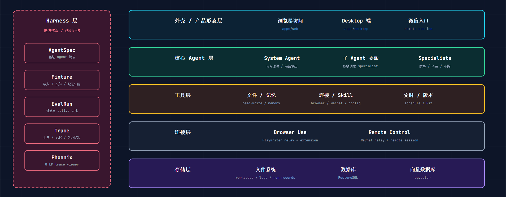
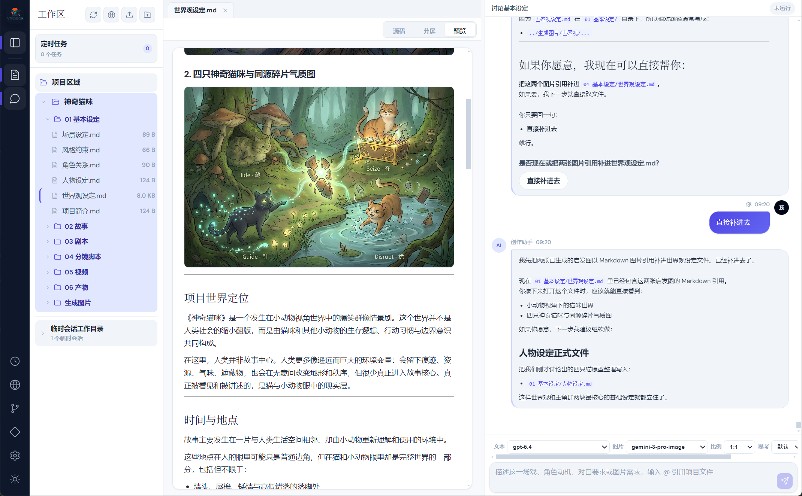
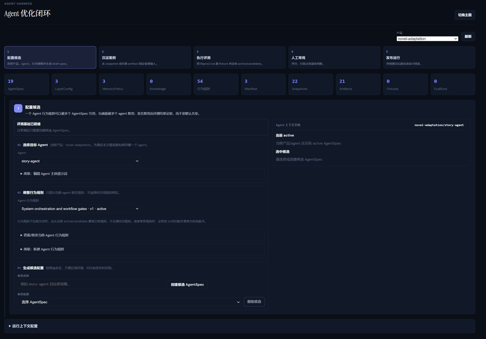
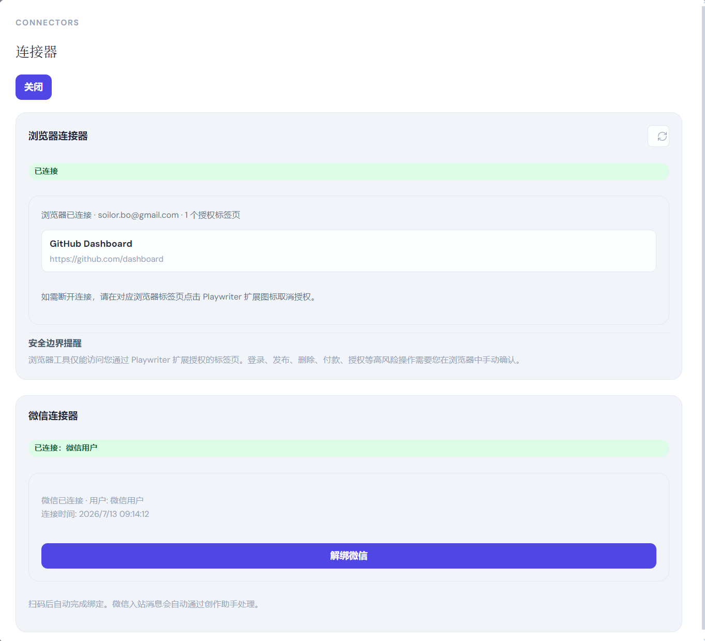

# ViForge

[中文](./README.md) | English

ViForge is a local-first AI collaboration workbench for creative production, knowledge work, and continuously improving agent workflows. It keeps project files, assistants, reusable skills, knowledge bases, model settings, runtime logs, and evaluation workflows in one controllable workspace, helping users turn judgment, taste, and working methods into reusable AI collaboration capabilities.

The current implementation focuses on novel adaptation, sitcom creation, and study workflows. Product profiles keep the system extensible for more vertical scenarios.

## Features

- Local-first workspaces: project files, agent configuration, memory, logs, and evaluation artifacts stay on the user's machine by default.
- Three-pane workbench: workspace tree, editor/preview tabs, and assistant chat work together.
- Product profiles: built-in templates for novel adaptation, sitcom creation, and study workflows, with per-project prompts, structures, and specialist skills.
- LangGraph agent runtime: streaming conversations, tool calls, long-term memory, and PostgreSQL/pgvector persistence.
- Reusable Agent Skills: workspace-managed `SKILL.md` files for domain capabilities that can evolve over time.
- Agent Harness: reproduce, compare, review, release, and roll back agent changes.
- Standalone desktop app: Windows installer is currently supported; download, install, and start using it.
- WeChat and browser collaboration: WeChat entry plus user-authorized browser automation boundaries.

## Product Architecture

<p align="center">
  
</p>

## Screenshots

<p align="center">
  
  <br>
  <strong>Workbench Home</strong>
</p>

<p align="center">
  
  <br>
  <strong>Harness Home</strong>
</p>

<p align="center">
  
  <br>
  <strong>Connectors</strong>
</p>

## Installation And Use

### Desktop App

The desktop app is intended for end users and currently supports Windows installation. Download the installer, complete installation, and open ViForge to start using the workbench.

### Docker Compose Deployment

The repository provides Docker Compose deployment for service-oriented use cases.

```bash
docker compose up -d --build
```

See [Current implementation overview](./docs/current/README.md) for full deployment details.

### Local Development

Install dependencies:

```bash
pnpm install
```

Start the local development services:

```bash
pnpm dev
```

More development, test, and build commands are in [Tests and development commands](./docs/current/09-tests-and-dev-commands.md).

## Model Configuration

ViForge does not include a hosted model service. Configure an OpenAI-compatible provider from the in-app system settings, including Base URL, API key, text model, image model, and embedding model.

System settings store API keys locally. The API only returns whether a key is configured; it does not echo stored secrets back to the web UI.

## Documentation

- [Current implementation overview](./docs/current/README.md)
- [Tests and development commands](./docs/current/09-tests-and-dev-commands.md)

## License And Notices

This repository is licensed under the MIT License. See [LICENSE](./LICENSE).

