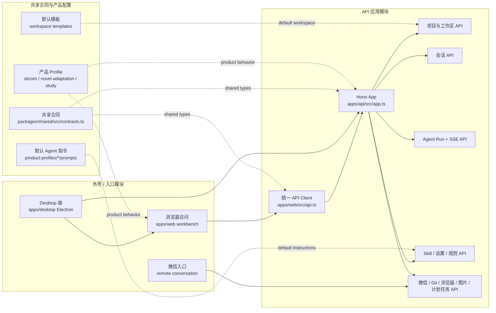
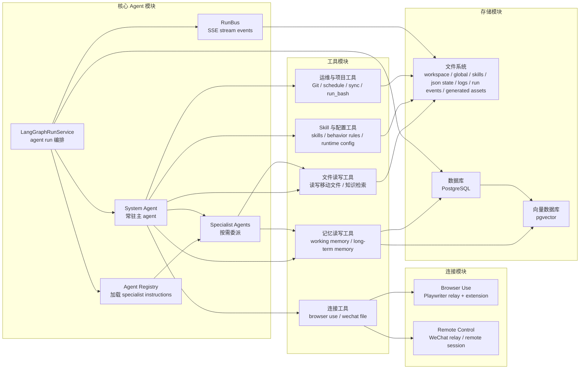
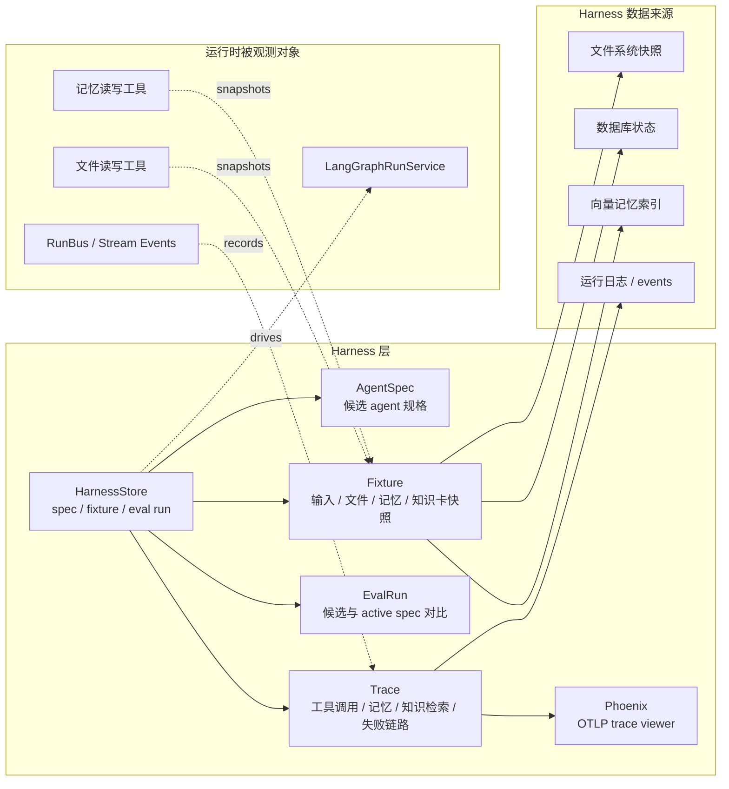

# 项目架构图 Markdown 草稿

> 状态：讨论草稿。本文先用 Markdown 线框确认架构分层、组件抽象和调用方向，确认后再同步重绘正式 HTML 架构图。

## 绘制原则

- 面向后续开发者快速理解项目结构和技术架构，优先表达层级、边界和依赖方向。
- 主节点使用功能抽象命名；当前技术实现放在节点小字中，例如“数据库 / PostgreSQL”“向量数据库 / pgvector”。
- 全局分层图不使用连接线，依靠上下位置表达依赖关系：上层基于下层能力构建，Harness 作为侧边统筹能力观察和驱动全局。
- 分模块调用关系图可拆成多张小图，避免单图过密。
- 不在架构图里展开非核心技术选型细节；外部模型网关等实现细节暂不进入主图。

## 1. 全局分层架构图

> 读法：从下往上看能力供给，从上往下看产品使用路径。Harness 层不是普通业务依赖层，而是侧边统筹运行评估、记录和回放。

| 侧边统筹 | 分层 | 抽象组件 | 当前实现提示 |
| --- | --- | --- | --- |
| Harness 层 | 外壳 / 产品形态层 | 浏览器访问、Desktop 端、微信入口 | `apps/web`、`apps/desktop`、WeChat entry |
| AgentSpec / Fixture / EvalRun / Trace | 核心 Agent 层 | System Agent、子 Agent 委派、Specialist Agents | LangGraph runtime、agent registry、skills instructions |
| Phoenix Trace / run event records | 工具层 | 文件读写、记忆读写、连接工具、定时任务、版本管理、Skill 与配置 | workspace tools、memory tools、browser/wechat tools、schedule、Git、SkillStore |
| 运行观测 / 评估回放 / 失败链路固化 | 连接层 | Browser Use、Remote Control、微信远程入口 | Playwriter relay、browser extension、WeChat relay |
|  | 存储层 | 文件系统、数据库、向量数据库 | workspace files / logs / run records、PostgreSQL、pgvector |

### 分层职责

| 分层 | 职责边界 |
| --- | --- |
| 外壳 / 产品形态层 | 呈现产品入口和用户使用形态，不承载核心 agent 逻辑。 |
| 核心 Agent 层 | 负责任务理解、计划、委派、综合输出和最终用户响应。 |
| 工具层 | 把核心 agent 的意图转成受控业务能力，不直接暴露底层系统。 |
| 连接层 | 连接外部可交互环境和远程入口，例如浏览器控制、微信入口。 |
| 存储层 | 保存工作区、结构化状态、长期记忆和向量索引；运行产物、run events 和日志归入文件系统。 |
| Harness 层 | 侧边统筹 agent 规格、fixture、eval run 和 trace，用于评估、回归和问题定位。 |

## 2. 分模块调用关系线框图

### 2.1 外壳、API 与共享配置

### 2.2 核心 Agent、工具、连接与存储

### 2.3 Harness 与观测评估

## 3. 当前抽象到实现的映射

| 抽象层级 | 抽象组件 | 当前实现 |
| --- | --- | --- |
| 外壳 / 产品形态层 | 浏览器访问 | `apps/web` React + Vite 工作台 |
| 外壳 / 产品形态层 | Desktop 端 | `apps/desktop` Electron，本地 API 与静态 Web 托管 |
| 外壳 / 产品形态层 | 微信入口 | WeChat routes / relay 状态 |
| 核心 Agent 层 | System Agent / 子 Agent 委派 | `apps/api/src/runs/langGraphRunService.ts`、`langGraphAgents.ts` |
| 工具层 | 文件读写工具 | workspace tools + `WorkspaceStore` |
| 工具层 | 记忆读写工具 | LangGraph Store namespaces + memory tools |
| 工具层 | Skill 与配置工具 | `SkillStore`、runtime config、behavior rules |
| 工具层 | 运维与项目工具 | Git、schedule、sync、run_bash 等工具能力 |
| 连接层 | Browser Use | Playwriter relay / browser extension |
| 连接层 | Remote Control | WeChat relay / remote session |
| 存储层 | 文件系统 | workspaces、skills、chat sessions、wechat state、logs、run events、generated assets |
| 存储层 | 数据库 | PostgreSQL，LangGraph checkpoint / Store |
| 存储层 | 向量数据库 | pgvector |
| Harness 层 | AgentSpec / Fixture / EvalRun / Trace | `apps/api` harness routes/store、run event 记录、Phoenix trace viewer |

## 4. 已处理的讨论意见

1. 全局分层架构图不再使用连接线，改为位置和表格表达依赖关系。
2. “产品 API 边界”从全局分层图移出，仅在分模块调用关系图中体现。
3. AIGC Hub 不再进入主图。
4. Phoenix 已移动到 Harness / 观测侧边栏。
5. Ops Tools 不再细拆，避免图过细。
6. 向量数据库只保留 pgvector，不再标注 Qdrant 预留。
7. 分模块调用关系图拆成三张：入口/API、核心/工具/存储、Harness/观测评估。
8. “运行产物与日志”并入文件系统，不再作为独立存储节点。

## 5. 正式图落版约定

1. 全局分层图采用左侧 Harness 侧栏 + 右侧五层堆叠的经典分层布局。
2. 分模块调用关系图保持拆分呈现，分别表达入口/API、核心/工具/存储、Harness/观测评估。
3. “运行产物与日志”并入文件系统，不再单独绘制存储节点。

