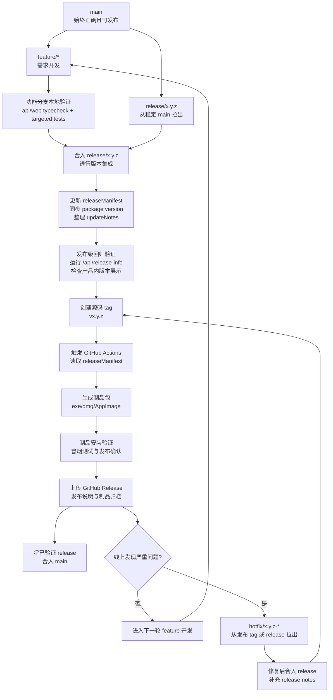

# ViForge 版本管理与发布指南

本文档面向 ViForge 开发者与发布维护者，说明当前版本管理机制、发布分支策略、版本迭代流程、制品构建流程以及发布归档要求。本文档属于发布教程，不用于描述单一版本的当前功能实现状态。

## 1. 目标与适用范围

ViForge 当前版本管理机制的目标是建立一条贯通以下对象的统一链路：

- 源码版本号
- Git tag
- 桌面制品包命名
- 产品内版本展示
- 更新说明
- CI/CD 发布参数

本文档适用于以下场景：

- 功能完成后的版本整理
- 桌面版正式发布或内部发布
- 热修复版本发布
- 发布前版本校验与归档

## 2. 统一版本源

当前实现使用一份统一的 release metadata 作为版本源。

- 共享 release manifest：`packages/shared/src/releaseManifest.ts`
- 对外合同类型：`packages/shared/src/contracts.ts` 中的 `ReleaseInfo`
- API 读取入口：`GET /api/release-info`

以下信息必须从同一份 release manifest 或同一组发布环境变量推导，不应在多个位置独立维护：

- `version`：产品版本号，例如 `0.1.0`
- `tag`：源码 tag，例如 `v0.1.0`
- `channel`：发布通道，例如 `beta`、`stable`
- `updateHeadline`：更新标题
- `updateNotes`：更新说明
- `artifacts`：各平台制品定义

## 3. 产品内版本展示

运行设置面板通过 `/api/release-info` 展示当前版本信息。当前产品内版本展示至少包含以下内容：

- 产品名称
- 产品版本号
- 发布通道
- 源码 tag
- 更新标题
- 更新说明
- 当前平台匹配的制品文件名

桌面模式下还会读取 Electron `app.getVersion()`，用于校验安装包版本与 release metadata 是否一致。

## 4. 版本号与制品命名规范

### 4.1 版本号规范

建议使用语义化版本策略：

- `major`：存在兼容性破坏、架构级改动或数据迁移风险
- `minor`：新增完整功能或新增可见能力
- `patch`：缺陷修复、回归修复、打包修复、文档修正

示例：

- `0.1.0`：首次建立统一版本管理链路
- `0.2.0`：新增自动更新能力
- `0.2.1`：修复发布包版本显示错误

### 4.2 Git tag 规范

源码 tag 必须与发布版本一一对应，并统一采用以下格式：

```text
v<major>.<minor>.<patch>
```

示例：

```text
v0.1.0
```

### 4.3 制品命名规范

建议所有桌面制品统一按如下规则命名：

```text
<ProductName>-<version>-<channel>-<platform>-<packageKind>.<ext>
```

示例：

```text
ViForge-0.1.0-beta-win32-x64-installer.exe
```

该命名应与 `ReleaseInfo.artifacts` 中定义的文件名保持一致，以便发布校验、问题排查和用户支持。

当前实现要求只在 `packages/shared/src/releaseManifest.ts` 中填写一次核心版本号。至少以下字段应由该单一值推导，而不是分别手工维护：

- `releaseManifest.version`
- `releaseManifest.tag`
- `releaseManifest.artifacts[*].fileName`
- CI 中的 `VIFORGE_RELEASE_VERSION`
- CI 中的 `VIFORGE_RELEASE_TAG`

## 5. 发布环境变量与 CI 集成

当前 Windows 桌面打包 workflow 直接从 `packages/shared/src/releaseManifest.ts` 读取发布元数据，并注入以下环境变量：

```text
VIFORGE_RELEASE_VERSION
VIFORGE_RELEASE_TAG
VIFORGE_RELEASE_CHANNEL
VIFORGE_RELEASE_COMMIT
```

这些变量用于将当前发布版本传递给：

- API 版本信息接口
- 前端产品内版本展示
- 桌面端版本校验
- 发布产物和归档记录

本地或 CI 可用以下命令读取同一份发布元数据：

```bash
node scripts/release-metadata.mjs
```

GitHub Actions 使用以下命令写入 step outputs：

```bash
node scripts/release-metadata.mjs --github-output
```

## 6. 分支模型

建议固定使用以下四类分支：

- `main`：始终保持正确、可集成、可继续发布
- `feature/*`：常规需求开发分支
- `release/*`：发布冻结、版本整理、最终验收分支
- `hotfix/*`：已发布版本的紧急修复分支

推荐命名：

- 功能分支：`feature/<topic>-<yyyymmdd>`
- 发布分支：`release/<major>.<minor>.<patch>`
- 热修复分支：`hotfix/<major>.<minor>.<patch>-<topic>`

### 6.1 主干约束

`main` 分支必须始终满足以下要求：

- 可以继续开发
- 可以继续集成
- 可以作为发布起点
- 不保留已知坏代码

版本号整理、发布说明编辑和发布期间的最后修复不应直接堆积在 `main` 上等待处理，而应通过 `release/*` 分支完成。

## 7. 标准版本迭代流程

建议将一次完整版本迭代划分为四个阶段：需求开发、发布准备、制品构建、发布归档。

### 7.1 阶段 A：需求开发

1. 从 `main` 拉出功能分支。
2. 在功能分支完成代码、共享合同与文档修改。
3. 按改动范围执行最小验证。
4. 提交评审并合并回 `main`。

建议最小验证命令：

```bash
pnpm --filter @viforge/api typecheck
pnpm --filter @viforge/web typecheck
pnpm --filter @viforge/api test -- runtimeConfig.test.ts
```

### 7.2 阶段 B：发布准备

准备发版时，应先从稳定基线拉出发布分支，再把候选功能分支合入发布分支完成集成验证。功能分支不应仅凭本地验证直接进入 `main`。

发布分支示例：

```text
release/0.1.1
```

在 `release/*` 分支上允许执行以下类型的变更：

- 合入计划进入本版本的 `feature/*` 分支
- 修复阻塞发布的问题
- 更新 `packages/shared/src/releaseManifest.ts`
- 同步 package `version`
- 整理更新说明
- 调整发布 workflow 或发布文档

发布准备阶段的检查项包括：

1. `releaseManifest.version` 已更新
2. `releaseManifest.tag` 与目标 tag 一致
3. `releaseManifest.updateNotes` 已覆盖本次用户可感知变化
4. 所有计划发布的功能分支已合入 `release/*`
5. `apps/api`、`apps/web`、`apps/desktop`、`packages/shared` 的 `version` 一致
6. `/api/release-info` 返回结果与计划发布版本一致

### 7.3 阶段 C：制品构建

1. 在发布分支创建源码 tag，例如 `v0.1.1`。
2. 触发 `.github/workflows/desktop-windows.yml`。
3. workflow 自动读取 `releaseManifest` 中的版本、通道和 tag。
4. 使用发布环境变量生成桌面制品。
5. 对产出结果执行版本一致性校验。

应重点核对以下内容：

- 制品文件名是否符合 `ReleaseInfo.artifacts`
- 产品内版本展示是否正确
- Electron `app.getVersion()` 是否与 package version 一致
- 更新说明是否与本次发布内容一致

### 7.4 阶段 D：发布归档

1. 将制品上传到对应 GitHub Release。
2. 保持 Release note 与 `releaseManifest.updateNotes` 一致。
3. 如存在严重线上问题，从对应 `release/*` 或 tag 拉出 `hotfix/*` 分支处理。
4. 发布完成后，将通过验证的 `release/*` 合入 `main`，使 `main` 接收已打包验证的完整版本。

## 8. 分支执行流程图



## 9. 推荐发布清单

发布前建议至少完成以下检查：

```bash
pnpm --filter @viforge/api typecheck
pnpm --filter @viforge/web typecheck
pnpm --filter @viforge/web build
pnpm --filter @viforge/api test
pnpm --filter @viforge/web test
pnpm desktop:pack
```

如需生成正式安装包，还应执行：

```bash
pnpm desktop:dist
```

## 10. 后续增强建议

当前版本已经打通版本元数据到 API、Web、桌面壳与 CI。后续可进一步补强：

- 增加 release manifest 校验脚本，自动校验 tag、package version、artifact 文件名一致性
- 将 GitHub Release notes 生成流程接入 `releaseManifest.updateNotes`
- 增加制品 SHA256 回填脚本
- 在桌面端接入自动更新源与 `latest.yml` 校验
