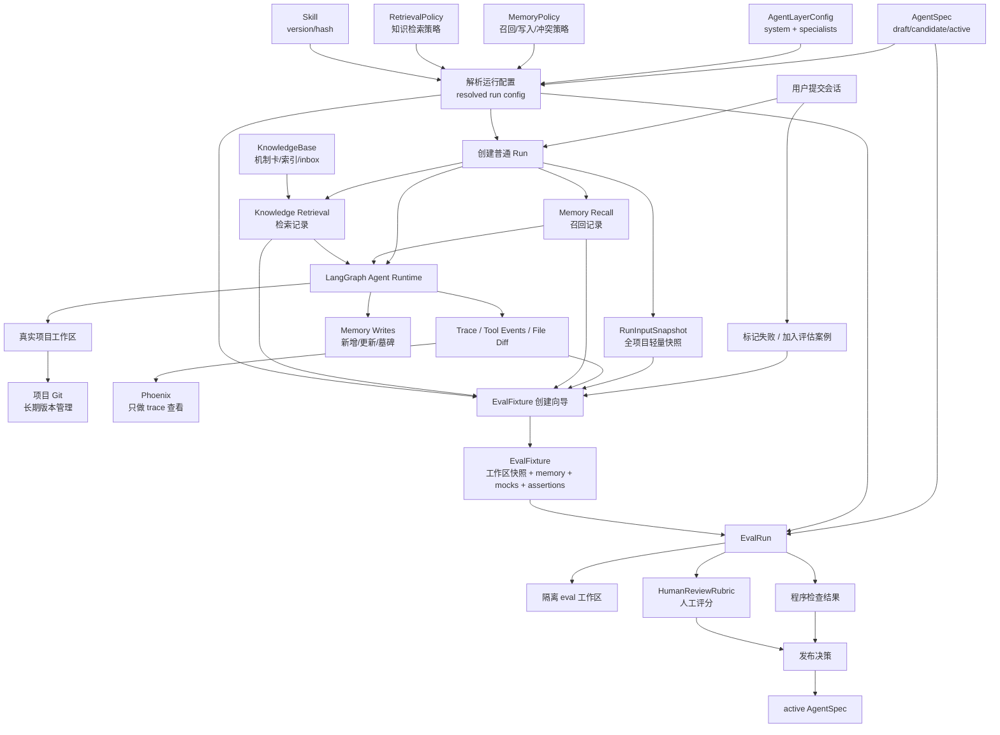
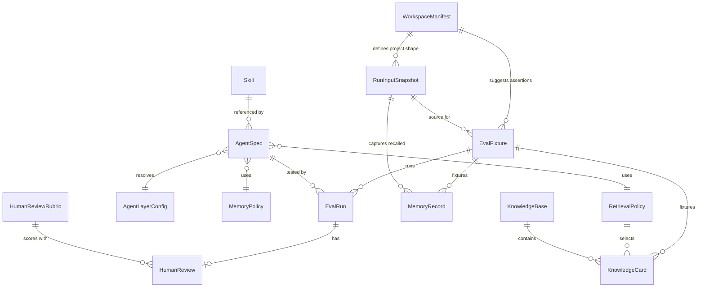

# Agent 优化 Harness 远景讨论稿

状态：第八轮讨论中

目标：建立 viforge 自己可控的 agent 优化闭环，让提示词、记忆、知识库、skill、工具策略和项目文件约束都能被版本化、验证、人工审阅、发布和回滚。Phoenix 暂时只作为 trace 查看工具；Langfuse 不再纳入方案；V1 不依赖 LLM judge，先采用规则检查和人工抽检。

## 1. 已收敛共识

1. harness 的核心不是“能跑 prompt”，而是能回答：这次 agent 配置变更是否让创作质量和运行可靠性变好。
2. viforge 需要自己的权威配置模型，外部平台最多承担 trace 和观测，不做 prompt/spec 主仓库。
3. 不追求完整时间机器式回放；失败案例应沉淀为可复现 fixture。V1 默认使用全项目轻量快照，后续再优化成最小/增量 fixture。
4. 项目初始化必须保持确定性，由模板和 manifest 控制；agent 可以生成初始内容草案，但不能自由决定基础目录结构。
5. project/session context 属于事实和状态，应进入文件、memory 或短期 state；prompt/spec 只描述行为规则。
6. 知识库应以“机制卡”为核心，避免直接沉淀可复刻的桥段全文；知识写入需要确认，工具层也要强制两阶段。
7. skill 管理先不接 AIGC Hub，先把本地创建、上传、编辑、启用、禁用、版本和回滚做扎实。
8. Agent 分层配置、记忆管理和知识库不能只作为背景能力存在，必须进入短期数据模型和 run metadata，否则 harness 只能评估 prompt 文本，无法评估真实 agent 行为。

## 2. 目标架构远景

viforge 应形成一个面向创作工作流的 agent operating system，但第一性目标不是平台化，而是让创作质量可迭代、可审计、可回滚。

核心模块：

1. AgentSpec：一次 agent 运行的行为配置，组合 prompt、skill、memory、retrieval、tool、model 策略。
2. PromptBlock：可复用的行为规则块，不存项目事实。
3. MemorySystem：管理 session/workspace/global 的事实、决定、偏好、事件，带 source、evidence、tombstone。
4. WorkspaceManifest：机器可读的项目目录、artifact 类型、正式文件路径和校验规则。
5. SkillManager：本地 skill 创建、上传、编辑、启用/禁用、版本和回滚。
6. KnowledgeBase：机制卡素材库，写入需要确认，检索用于启发而非复制。
7. HarnessUI：围绕 candidate -> eval -> human review -> active/rollback 的闭环。
8. TraceViewer：Phoenix 只做观测出口，viforge run metadata 保证可追溯。

关键边界：

- 产品结构和正式 artifact 规则由 manifest 约束，不由 agent 即兴决定。
- agent 可以生成内容、建议修改、执行受控工具，但不能绕过 manifest 和写入边界。
- 记忆和知识都必须可追溯来源；自动沉淀必须谨慎，关键写入需要用户确认或明确授权。
- eval 不追求输出完全一致，而是检查行为、文件 diff、关键约束和人工质量结论。

## 3. AgentSpec 与 PromptBlock

AgentSpec 是 viforge 的核心版本化对象。它回答“这次运行到底采用了哪套 agent 行为配置”。

建议字段：

```yaml
id: sitcom-story-agent-v3
productId: sitcom
agentId: story-agent
version: 3
status: draft | candidate | active | archived
promptBlocks:
  - id: global-tool-policy
    version: 2
  - id: sitcom-story-quality
    version: 5
skillRefs:
  - skillId: story-agent
    version: 4
memoryPolicyRef: sitcom-default-memory@2
retrievalPolicyRef: comedy-mechanism-retrieval@1
toolPolicyRef: workspace-safe-write@3
modelPolicyRef: default-chat-model@1
changelog: ...
```

PromptBlock 只存行为规则，例如：

- 工具使用边界。
- 图片生成前是否确认。
- 故事质量标准。
- 审稿输出格式。
- 正式文件写入原则。

PromptBlock 不应存项目事实，例如某个项目的人物设定、故事历史、当前会话决定。那些属于 context/memory/file。

批判点：如果把项目事实放进 PromptBlock，会导致每个项目都变成一套特殊 prompt，后续无法比较不同 AgentSpec 的效果；同一个 eval case 也会被项目私有 prompt 污染。

## 4. project/session context 的边界

你问“project 和 session context 是不是就在记忆管理中做”，答案是：大体是，但要分层。

三类信息不能混：

1. 行为规则：agent 应该怎么工作。放在 AgentSpec/PromptBlock/Skill。
2. 项目事实：这个项目已经确定了什么。优先放在正式文件，其次是 workspace memory 和文件摘要索引。
3. 会话状态：这轮对话正在做什么、用户刚确认或否定了什么。放在短期 state、session summary、decisions、discarded options。

例子：

```text
行为规则：故事必须有主角目标、阻力、升级、选择、后果。
项目事实：主角叫老周，是社区物业经理，怕担责但爱面子。
会话状态：用户刚否定“广场舞比赛”方向，确认改成“业主群误会”。
```

这三类信息在 prompt 组装时都会进入模型上下文，但来源和生命周期不同：

- 行为规则随 AgentSpec 版本变化。
- 项目事实随项目文件和 workspace memory 变化。
- 会话状态随当前 session 变化。

批判点：把它们都叫“提示词”会让系统不可控。prompt assembly 可以把它们拼到一次模型调用中，但存储和版本管理必须分开。

## 5. WorkspaceManifest 与项目初始化

项目初始化不建议交给 agent 执行。原因不是 agent 做不到，而是初始化属于产品契约，必须确定、可测试、可迁移。

建议引入 `project-manifest.json` 或等价数据结构：

```json
{
  "productId": "sitcom",
  "templateVersion": 1,
  "requiredDirectories": ["01 人物", "02 故事", "03 剧本", "04 资料"],
  "artifactTypes": {
    "story": {
      "canonicalPath": "02 故事/{episode}/故事正文.md",
      "requiredSections": ["标题", "一句话故事核", "故事正文", "主角目标", "主要阻力", "升级链条"]
    },
    "screenplay": {
      "canonicalPath": "03 剧本/{episode}/剧本.md",
      "requiredSections": ["冷开场", "正戏", "结尾"]
    }
  }
}
```

这个 manifest 应成为三件事的共同来源：

1. 项目初始化：代码根据 manifest 创建目录和默认文件。
2. agent 目录约束：prompt assembly 把 manifest 摘要提供给 agent。
3. 项目检查器：检查正式 artifact 是否缺失、过期或结构不合规。

批判点：如果目录约定只写在 prompt 里，代码无法可靠判断哪些文件是正式产物，agent 也可能在不同运行中发明不同路径。manifest 是机器约束，prompt 只是把约束解释给 agent。

## 6. MemoryRecord 设计

长期记忆建议按 namespace 分层，但预留 product 和 user 维度：

```text
['viforge', productId, 'users', userId, 'global', ...]
['viforge', productId, 'workspaces', projectId, ...]
['viforge', productId, 'sessions', sessionId, ...]
```

当前只有开发者自己时，`userId = default` 即可。这样不增加使用复杂度，但避免未来迁移困难。

MemoryRecord 最小字段。这里需要明确区分两层：LangGraph Store 的 namespace 是存储和检索边界，MemoryRecord 里的 namespace 是审计和调试字段。实际写入 LangGraph Store 时，应把 namespace 作为外层参数传给 store；record 内部也建议冗余保存一份 namespace 字符串或数组，方便导出、fixture、UI 展示和问题追踪。

```json
{
  "id": "mem_...",
  "namespace": ["viforge", "sitcom", "workspaces", "project_123", "memories"],
  "scope": "session | workspace | global",
  "memoryType": "profile | knowledge | event | decision | constraint | summary",
  "authority": "user_explicit | file_derived | agent_inferred | workflow_event",
  "updateMode": "upsert | append | summarize | tombstone",
  "key": "optional-stable-key",
  "content": "...",
  "evidenceRefs": [
    { "type": "file", "path": "01 人物/老周.md", "hash": "..." },
    { "type": "message", "sessionId": "...", "messageId": "..." },
    { "type": "run", "runId": "..." }
  ],
  "confidence": 0.8,
  "createdByAgent": "story-agent",
  "createdAt": "...",
  "updatedAt": "...",
  "tombstonedAt": null
}
```

批判点：namespace 不能只靠 prompt 约束。为了避免检索混淆，工具层必须禁止跨 product、project、session 的默认检索；跨 scope 检索只能在明确策略下发生，例如先查 session decisions，再查 workspace facts，最后才查 global preference。

文件优先级：正式文件 > 文件摘要索引 > workspace memory > session memory > global preference。发生冲突时，应提示冲突并以正式文件为准。

短期状态建议包括：当前用户目标、未完成子任务、当前 workflow stage、最近消息、本轮工具结果、未落盘候选内容、reviewer 打回原因、返工轮次、用户刚确认/否定的方向。

批判点：没有 evidenceRefs、namespace 和 tombstone 的记忆系统会快速污染。创作项目里设定经常被推翻，覆盖旧值不够，还要能知道旧值为什么失效、属于哪个作用域、是否应该被当前 run 召回。

## 7. EvalFixture 与回放策略

你问“固定回归案例怎么判定能跑？有对应文件输出吗？输出本来就不稳定”。这里要把 eval 目标从“输出完全一致”改成“行为和约束稳定”。

固定回归案例的 pass/fail 不应依赖生成文本逐字一致，而应依赖：

- run 是否完成且无错误。
- 是否调用了预期工具或阶段，例如 story -> review -> save。
- 是否写入 manifest 规定的 canonical path。
- 是否没有写入禁止路径。
- 是否保留用户明确约束。
- 是否生成必需结构段落。
- 文件 diff 是否落在允许范围内。
- 人工标注是否认为质量退化。

UI 上不要让用户直接写 YAML 断言。更合适的是提供“检查项构建器”，把常见断言做成表单：

- 运行结果：必须成功 / 允许失败但要有错误类型。
- 阶段检查：必须经过 story、review、save；或禁止跳过 reviewer。
- 文件检查：必须创建/修改哪些路径，禁止修改哪些路径。
- 结构检查：目标文件必须包含哪些标题、字段或 markdown section。
- 约束检查：输出必须包含或不得包含某些关键词、人物名、设定。
- 人工检查：需要人工判断故事因果、人物声音、喜剧机制。

UI 可以把这些表单保存成 assertions.yaml，普通用户看表单，系统看结构化断言。

专项失败案例应支持从会话中创建。建议 UI 提供“加入评估案例”动作，但不要默认完整复制会话历史。更合理的是：

1. 先自动抓取失败消息前后若干轮、引用文件、相关工具事件、最终 diff。
2. 让用户在 UI 中裁剪：保留哪些消息、哪些文件、哪些 memory、哪些知识检索结果。
3. 保存为可复现 EvalFixture：工作区默认来自 run input full_project snapshot，消息、memory、知识检索结果再由用户裁剪。

长会话案例不应该只测试工具结果。工具结果只能证明 memory API 可用，不能证明 agent 会正确使用记忆。建议拆成两类：

- memory unit test：测试 summary、decision、discarded option 的读写和召回。
- long-session eval：用多轮输入验证 agent 在上下文压缩后仍遵守已确认决定、不重复被否定方向。

EvalFixture 建议结构：

```text
eval-cases/<caseId>/
  case.yaml
  workspace/          # run 输入时的全项目轻量快照，排除缓存/构建产物/大文件
  memory.json         # 裁剪后的 memory records
  tool-mocks.json     # 可选，mock 未被测试的工具结果
  expected/
    assertions.yaml
    allowed-diff.yaml
```

case.yaml 关键字段：

```yaml
caseId: story-conflict-too-flat-001
productId: sitcom
target: story-agent-workflow
sourceTraceId: optional
inputMessages: []
referencedFiles: []
workspaceFixture: workspace/
memoryFixture: memory.json
mockPolicy:
  readWorkspaceFile: fixture
  recallMemory: fixture
  retrieveKnowledge: mock
assertions:
  mustWrite:
    - "02 故事/第01集/故事正文.md"
  mustNotWrite:
    - "01 人物/**"
  requiredSections:
    - "主角目标"
    - "主要阻力"
    - "升级链条"
```

程序评判可以分三步：

1. 识别文件变化：eval run 在隔离工作区执行，运行前后遍历文件树，计算 hash，得到 created/modified/deleted diff。
2. 识别目标 artifact：优先根据工具事件中的 `write_workspace_file` path；其次根据 diff path；再用 WorkspaceManifest 的 artifactTypes 匹配 canonicalPath。
3. 检查文件内容：Markdown 用 heading parser 解析标题层级；普通文本用正则或 requiredText；JSON/YAML 用结构化 parser。

示例断言：

```yaml
assertions:
  files:
    mustCreateOrModify:
      - path: "02 故事/第01集/故事正文.md"
        artifactType: story
    mustNotModify:
      - "01 人物/**"
      - "Agent 配置/**"
  markdown:
    - path: "02 故事/第01集/故事正文.md"
      requiredHeadings:
        - "一句话故事核"
        - "故事正文"
        - "主角目标"
        - "主要阻力"
        - "升级链条"
      requiredText:
        - "业主群"
      forbiddenText:
        - "广场舞比赛"
  toolEvents:
    mustCall:
      - "delegate_to_specialist_agent:story-agent"
      - "delegate_to_specialist_agent:reviewer-agent"
```

批判点：这种程序检查只能判断“产物结构和硬约束”，不能判断故事好不好。内容质量仍要靠人工标注，除非后续重新引入 LLM judge。

## 8. 关于 mock 未改动节点

你提出“mock 其它没改动的节点来实现复现，尤其是记忆获取和文件内容读取”，这个方向是对的，但要明确 mock 的边界。

我建议采用 selective mocking：只真实执行被测试对象，其他依赖尽量 fixture 化。

例如测试 story-agent prompt 变更：

- 真实执行：story-agent、reviewer-agent、prompt assembly、受控 workspace write。
- fixture/mock：read file 返回 fixture 文件内容，recall memory 返回 memory.json，retrieve knowledge 返回 tool-mocks.json，图片/微信/外部同步禁用。

例如测试 memory policy 变更：

- 真实执行：memory summarizer、memory write/read、recall 策略。
- fixture/mock：LLM 创作输出可以用固定文本或小模型输出，workspace 文件固定。

批判点：mock 太多会让 eval 脱离真实系统，mock 太少又难复现和成本过高。原则是：一次 eval 只让“正在比较的变量”真实变化，其他依赖固定住。

工具层需要支持三种模式：

```text
live：真实调用工具。
fixture：从 EvalFixture 读取固定结果，例如文件和 memory。
mock：从 tool-mocks.json 返回预设结果，例如知识检索。
```

文件读取建议用 fixture，不叫 mock。因为它不是假结果，而是 case 的最小工作区快照。记忆获取也类似，memory.json 是该 case 的记忆快照。真正需要 mock 的是外部不稳定依赖，例如知识检索、图片生成、远程同步。

测试时绝不能直接在真实项目目录运行。正确做法是每次 eval 都创建隔离 run workspace：

1. 从 EvalFixture 的 `workspace/` 复制到临时目录，例如 `/tmp/viforge-eval-runs/<runId>/workspace`。
2. agent 的所有 workspace tools 都指向这个临时目录。
3. 运行结束后对临时目录做 diff，并保存到 eval artifact。
4. 真实项目目录完全不被修改。

如果失败 case 来自真实会话，但当时没有备份，也只能在“创建 eval case 的那一刻”抓取当前文件内容。它可能已经不是失败发生时的原始状态，这是不可逆的。解决方式是以后从现在开始记录足够 artifact：run trace、工具事件、写入前后 hash、关键文件快照。对历史失败，只能人工补 fixture。

批判点：不能指望没有快照还能完美复现过去。harness 的一个价值就是从建设后开始留下可复现证据；历史案例需要人工整理成近似 fixture。

## 9. Harness UI

UI 先做简陋版本是合理的，但它必须围绕闭环，不应只是 prompt 文本编辑器。

第一版 UI 核心流程：

```text
选择 agent/spec -> 编辑 prompt/skill -> 选择 eval suite -> 运行 -> 看 trace/file diff -> 人工标注 -> 设为 candidate/active
```

建议页面：

- Agent 配置：system agent 和 specialist agents，显示 active/candidate/draft 版本。
- Prompt/Skill 编辑：编辑 instructions、SKILL.md、PromptBlock 引用。
- Eval Cases：列表、详情、从失败 run 创建 case、裁剪 fixture。
- Eval Runs：展示输入、输出、工具调用、文件 diff、规则检查、人工结论。
- 发布记录：candidate -> active、active -> rollback。

人工标注至少包括：

```text
pass | fail | improved | regressed | needs_regression_case
reason
reviewer
createdAt
```

批判点：如果 UI 没有 eval run、diff、人工结论和版本状态，它只会复刻 Langfuse 式的松散 prompt 管理问题。

可参考的成熟形态不是单一产品，而是几类产品模式的组合：

- Promptfoo：适合参考 eval case、assertions、批量运行、对比结果。它的价值在于把 LLM 行为测试产品化，但它偏 CLI/表格，不适合直接照搬到 viforge 的创作工作区。
- LangSmith：适合参考 dataset、experiment、trace、run comparison。它的价值在于把一次 run 和数据集绑定起来，但它是外部平台，不应成为 viforge 配置源。
- Humanloop / Braintrust：适合参考人工标注、实验对比、prompt 版本和发布流程。它们的核心启发是 candidate -> eval -> review -> deploy，而不是具体 UI。
- GitHub PR checks：适合参考“变更必须通过检查和人工 review 才能合并”的心智模型。AgentSpec candidate 可以类比成 PR，active 可以类比成 main。
- VCR.py / Polly.js 这类测试录制工具：适合参考 fixture replay 思路，即外部依赖录制/固定，避免每次测试都 live 调用。

我建议 viforge 不照搬任何一个，而是采用更贴近创作的 UI：左边 case 和 spec，中间输出和文件 diff，右边规则检查和人工标注。因为 viforge 的关键对象不是单条 prompt 输出，而是“对工作区文件产生影响的一次创作 run”。

批判点：成熟 eval 产品大多面向 API prompt 或客服问答，不能直接解决 viforge 的文件工作区、agent 工具调用和创作质量人工判断。参考它们的概念，不要照搬信息架构。

## 10. Skill 与 AgentSpec 的关系

skill 是能力包或 specialist instructions；AgentSpec 是一次运行时采用哪些能力和策略的组合。

本地 SkillManager 远景能力：

- 创建：从空白、模板、对话沉淀创建 skill。
- 上传：导入本地 `SKILL.md` 或压缩包。
- 编辑：在线编辑 frontmatter 和正文。
- 启用/禁用：按 product、agent、workspace 覆盖。
- 版本：每次保存形成版本快照，active run 使用固定版本。
- 回滚：回到历史版本。
- 验证：检查 frontmatter、描述、输出格式、依赖工具。

覆盖规则建议：

```text
workspace override > product override > global default
```

但要谨慎使用 workspace override。它会让某个项目的 agent 行为偏离默认 spec，导致 eval 结果不一定能解释线上行为。

批判点：skill 启用/禁用不能只存在 UI 状态里，必须进入 AgentSpec 或 run metadata。否则一次失败 run 无法追溯到底用了哪个 skill 版本。

## 11. KnowledgeBase

同意先不把知识库系统复杂化。用文本目录结构实现更符合 viforge 当前本地优先和可编辑工作区的形态，也更方便人工维护、git diff、agent 读取和后续迁移到 LightRAG。

建议知识库先放在全局工作区：

```text
知识库/
  README.md
  index.yaml
  tags.yaml
  mechanisms/
    误会升级/
      index.yaml
      业主群误会升级.md
      身份错认.md
    关系张力/
      index.yaml
      面子与责任.md
  jokes/
    index.yaml
    语言误读.md
  viewpoints/
    index.yaml
    小区治理荒诞性.md
  inbox/
    待整理-2026-06-29.md
```

`知识库/index.yaml` 作为全局索引：

```yaml
version: 1
entries:
  - id: kb-mechanism-owner-group-misread
    title: 业主群误会升级
    path: mechanisms/误会升级/业主群误会升级.md
    type: mechanism
    tags: [误会, 群聊, 升级]
    rightsRisk: low
    updatedAt: "2026-06-29"
```

单个知识卡仍用 Markdown，frontmatter 存机器可读字段，正文给人和 agent 读：

```md
---
id: kb-mechanism-owner-group-misread
type: mechanism
tags: [误会, 群聊, 升级]
rightsRisk: low
source: ""
---

# 业主群误会升级

## 机制
信息不对称导致群体误判，主角越解释越像掩饰。

## 情绪功能
制造尴尬、加压和关系错位。

## 适用场景
- 社区
- 办公室
- 家庭群

## 不可复用细节
- 不复用具体台词。
- 不复用原桥段人物和场景。

## 示例变体
- 物业通知措辞含糊，引发业主群连锁误解。
```

写入流程可以先不做复杂数据库事务，但仍建议两阶段：

1. agent 或用户先写到 `知识库/inbox/`，作为待整理文本。
2. 用户确认后，通过 UI 或工具整理为正式知识卡，并更新 `index.yaml`。

批判点：文本目录不等于无结构。没有 index.yaml、frontmatter、tags.yaml，后续检索会退化成全文乱搜，agent 也很难稳定知道哪些内容可信、哪些只是待整理材料。

## 12. 项目一致性检查器

文件约束需要更强，因为 workspace memory 的可靠性依赖正式文件。

检查类型：

- manifest 检查：必需目录和关键文件是否存在。
- artifact 检查：故事、剧本、人物设定是否符合基本结构。
- memory-file conflict 检查：workspace memory 中的设定是否与正式文件冲突。
- stale summary 检查：文件修改后，摘要索引或 memory 是否过期。
- orphan artifact 检查：临时草稿是否被误认为正式产物。

触发方式：

- 手动：用户点击“检查项目”。
- 关键写入后：agent 写入正式故事/剧本后自动检查相关范围。
- 启动或低频定期：只给提醒，不自动修改。

批判点：检查器不要一开始自动修复。创作文件有主观性，自动修复可能破坏用户内容。V1 应先报告问题和建议，修复动作需要确认。

## 13. 下一轮讨论焦点

本轮先把五个开放点收敛成设计决策。

### 13.1 AgentSpec 存储位置

决策：AgentSpec 存 API 数据模型，不以全局工作区文件作为唯一权威来源。

理由：AgentSpec 不是普通用户创作文件，而是运行时配置和发布状态。它需要支持 draft/candidate/active/archived、版本快照、发布记录、回滚、eval 关联和 run metadata 追踪，这些更适合 API 数据模型管理。

但建议保留导入/导出能力：

- API 数据模型是运行时权威。
- 可导出为 YAML/JSON，便于备份、diff、迁移和审查。
- 默认 product profile 仍可在代码仓库里提供 seed spec，初始化后进入 API 数据模型。

批判点：如果只存在数据库里，人工审查和迁移会变差；如果只存在文件里，状态机、发布流和并发编辑会变差。因此推荐“API 为权威，文件为导入导出和 seed”。

### 13.2 WorkspaceManifest 是否加入创意度打分

不建议把“创意度打分”放进 WorkspaceManifest。

WorkspaceManifest 的职责是定义项目结构和 artifact 约束，例如路径、必需章节、正式产物类型、校验规则。创意度是质量评估维度，不是项目文件结构维度。把创意度放进 manifest 会混淆“产物是否合法”和“产物好不好”。

更合理的位置是 EvalRubric 或 HumanReviewRubric：

```yaml
rubric:
  story:
    hardChecks:
      - hasProtagonistGoal
      - hasObstacle
      - hasEscalationChain
      - writesCanonicalPath
    humanScores:
      - id: causality
        label: 因果推进
        scale: 1-5
      - id: characterConsistency
        label: 人物一致性
        scale: 1-5
      - id: comedyMechanism
        label: 喜剧机制
        scale: 1-5
      - id: originality
        label: 创意度
        scale: 1-5
      - id: performability
        label: 可表演性
        scale: 1-5
```

创意度可以拆得更具体，否则人工打分会很飘：

- 设定新鲜度：故事切入点是否不是陈词滥调。
- 机制新鲜度：误会、冲突、反转的运作方式是否有变化。
- 人物使用新鲜度：是否挖出了角色新侧面，而不是重复固定标签。
- 情境贴合度：创意是否服务情景剧场景，而不是为了奇观牺牲可拍性。
- 回收质量：前面埋的关系、道具、误会是否被有趣地回收。

批判点：创意度必须人工评估，短期不要强行程序化。程序可以检查“有没有结构”，但很难判断“是不是新鲜”。

HumanReviewRubric 建议进入 API 数据模型，并支持按 artifactType 配置。短期不需要做复杂权限或多版本协作，但要能记录 rubricVersion，保证历史评分可解释。

```json
{
  "id": "sitcom-story-human-review-v1",
  "productId": "sitcom",
  "artifactType": "story",
  "version": 1,
  "status": "active",
  "hardChecks": [
    { "id": "has_protagonist_goal", "label": "主角目标明确", "source": "program" },
    { "id": "has_obstacle", "label": "主要阻力明确", "source": "program" },
    { "id": "has_escalation_chain", "label": "存在升级链条", "source": "program" },
    { "id": "writes_canonical_path", "label": "写入正式路径", "source": "program" }
  ],
  "humanScores": [
    {
      "id": "causality",
      "label": "因果推进",
      "scale": 5,
      "anchors": {
        "1": "事件只是罗列，缺少因果连接",
        "3": "主要因果成立，但部分转折靠巧合",
        "5": "每一步选择和后果都自然推动下一步"
      }
    },
    {
      "id": "character_consistency",
      "label": "人物一致性",
      "scale": 5,
      "anchors": {
        "1": "角色行为明显脱离设定",
        "3": "大体符合设定，但声音或动机偶有漂移",
        "5": "行为、台词和选择都来自角色欲望与缺点"
      }
    },
    {
      "id": "comedy_mechanism",
      "label": "喜剧机制",
      "scale": 5,
      "anchors": {
        "1": "主要靠硬塞段子或口号",
        "3": "有误会或冲突，但升级不足",
        "5": "笑点来自人物缺点、关系错位和情境压力的递进"
      }
    },
    {
      "id": "originality",
      "label": "创意度",
      "scale": 5,
      "subScores": [
        "premise_freshness",
        "mechanism_freshness",
        "character_angle_freshness",
        "situational_fit",
        "setup_payoff_quality"
      ]
    },
    {
      "id": "performability",
      "label": "可表演性",
      "scale": 5,
      "anchors": {
        "1": "主要依赖解释和心理描写，难以表演",
        "3": "多数场面可演，但动作和对白仍偏说明",
        "5": "冲突、动作、对白和节奏都可被演员直接执行"
      }
    }
  ],
  "decisionRules": {
    "minimumAverageScore": 3.5,
    "minimumRequiredScores": {
      "causality": 3,
      "character_consistency": 3,
      "comedy_mechanism": 3
    },
    "requiresHumanDecision": true
  }
}
```

EvalRun 的人工评分记录建议这样存：

```json
{
  "evalRunId": "eval_run_...",
  "rubricId": "sitcom-story-human-review-v1",
  "rubricVersion": 1,
  "reviewer": "default",
  "decision": "pass | fail | improved | regressed | needs_regression_case",
  "scores": {
    "causality": 4,
    "character_consistency": 3,
    "comedy_mechanism": 4,
    "originality": 3,
    "performability": 4
  },
  "subScores": {
    "originality": {
      "premise_freshness": 3,
      "mechanism_freshness": 4,
      "character_angle_freshness": 3,
      "situational_fit": 4,
      "setup_payoff_quality": 3
    }
  },
  "notes": "故事机制有进步，但人物声音还不够分化。",
  "createdAt": "..."
}
```

批判点：打分维度不能太多。维度太多会降低人工标注频率。V1 可默认只显示 5 个主分，创意度子项放在展开区，用于需要细查时填写。

### 13.3 从会话创建 EvalFixture 的裁剪流程

成熟产品的共同做法是 dataset/experiment 化：LangSmith 和 Braintrust 都会把线上 run 转成 dataset example，再让用户补 expected output、metadata、评分结果。viforge 需要借鉴这个思想，但要加上工作区文件和 memory 裁剪。

建议 UI 做成三步 wizard，而不是让用户面对一堆底层文件：

1. 选择问题片段。
   - 默认选中当前消息前 3 轮和后 1 轮。
   - 自动带上用户显式引用的文件。
   - 自动带上本 run 实际读取过、写入过的文件。
   - 用户可以勾选增删消息和文件。

2. 选择上下文快照。
   - 文件：默认包含引用文件、工具读取文件、被修改文件的写入前版本。
   - memory：默认包含本 run 召回过的 memory records。
   - tool events：默认保留所有工具事件摘要。
   - 知识检索：默认保存检索 query 和返回结果，作为 mock 候选。

3. 定义检查项。
   - UI 自动根据 manifest 推荐 mustWrite、mustNotWrite、requiredSections。
   - 用户选择失败原因标签，例如“人物跑偏”“故事无升级”“审稿放水”。
   - 用户选择是否加入回归套件。

默认选择策略：宁可多带一点上下文，也不要让用户从零理解依赖。创建后可以再瘦身 fixture。

批判点：让用户手动选择所有消息、文件、memory 是不现实的。系统必须基于 trace 自动推荐，用户只做确认和删减。否则这个功能会因为操作成本高而没人用。

这里确实应该利用现有项目 git 版本管理能力，但要明确它在 harness 里的角色：git 适合做项目级历史和远端备份，不适合替代 EvalFixture 的最小快照。

进一步看，如果程序在“提交会话 / 创建 run”那一刻主动捕获工作区状态，那么工作区复现可以做得非常可靠。这个思路比事后从当前文件猜测状态更强，因为失败发生前的输入文件已经被系统记录下来。

建议把 run 启动前的快照作为一等 artifact：

```yaml
runInputSnapshot:
  runId: run_123
  projectId: project_123
  capturedAt: "2026-06-29T..."
  projectGitCommit: "abc1234"
  projectGitDirty: true
  snapshotMode: "full_project"
  root: "snapshots/run_123/workspace"
  excludeRules:
    - ".git/**"
    - "node_modules/**"
    - "dist/**"
    - "*.tsbuildinfo"
    - ".DS_Store"
  fileManifest:
    - path: "01 人物/老周.md"
      hash: "sha256:..."
      size: 1234
      captured: true
    - path: "02 故事/第01集/故事正文.md"
      hash: "sha256:..."
      size: 4567
      captured: true
  referencedFiles:
    - "01 人物/老周.md"
  readPolicy: "referenced_and_relevant | full_project"
```

这里的默认策略应改成全项目快照，而不是最小快照。

- 全项目快照：run 开始时复制整个项目工作区，忽略 `.git`、缓存、构建产物和大文件。修复后的 agent 可以读取当时项目中存在的任意文件，不会因为 fixture 裁剪过度而读不到。
- 最小快照：只适合作为未来优化，不适合作为 V1 默认。它成本低，但会带来一个严重问题：修复后的 agent 可能选择读取失败 run 当时没读过、但其实对问题有帮助的文件，结果在 eval 中读不到，导致复现环境人为失真。

因此 V1 应采用“全项目轻量快照 + 排除规则”。原因是 viforge 项目文件主要是文本，规模可控；完整复制工作区能显著降低 fixture 裁剪和复现复杂度。后续如果项目变大，再优化成内容寻址和增量快照。

全项目快照仍然要有边界：

- 不复制 `.git`，git commit hash 只作为 metadata 记录。
- 不复制 node_modules、dist、缓存、临时 agent home、日志、大型二进制。
- 对图片、音频等大文件可以先复制 metadata 和 hash，超过阈值时提示用户是否包含。
- 快照目录必须只供 eval 使用，不能被当成正式项目继续编辑。

批判点：这能解决“工作区状态复现”，但不能单独保证“完整运行复现”。要接近完整复现，还需要同时记录 session messages、referenced snippets、memory recall 结果、knowledge retrieval 结果、AgentSpec 版本、skill hash、model 信息和工具事件。否则工作区一致，agent 仍可能因为记忆或模型随机性输出不同内容。

推荐做法：

- 正式项目继续使用现有 git 工作区管理，关键节点可以生成 commit，例如“agent 写入第 1 集故事正文”“人工确认定稿”。
- 每次创建 run 时自动生成 run input snapshot，默认保存全项目轻量快照和 fileManifest。
- 创建 EvalFixture 时，记录当前项目 git commit hash、dirty 状态、相关文件 hash。
- 如果 run input snapshot 存在，优先从 snapshot 生成 fixture，而不是从当前工作区或 git commit 推断。
- 如果项目是干净 git 状态，也可以从 commit 读取文件快照，作为 snapshot 的校验或补充。
- 如果项目有未提交改动，snapshot 可以直接捕获这些内容；UI 仍应标记 `gitDirty: true`，提醒这是未提交状态下的失败案例。
- Eval run 始终复制 fixture 到隔离目录执行，不直接在 git 工作区运行。

EvalFixture metadata 建议增加：

```yaml
sourceProject:
  projectId: project_123
  gitCommit: "abc1234"
  gitDirty: true
  capturedAt: "2026-06-29T..."
  capturedFiles:
    - path: "01 人物/老周.md"
      source: "working_tree | git_commit"
      hash: "..."
    - path: "02 故事/第01集/故事正文.md"
      source: "pre_write_snapshot"
      hash: "..."
```

更进一步，agent 正式写文件前可以记录 pre-write snapshot：路径、旧内容 hash、必要时保存旧内容。这样即使用户后来改了文件，也能从 run artifact 里生成失败 fixture。

批判点：不要把 eval fixture 直接绑死到 git commit。很多失败发生在未提交的工作树中，如果只接受 git commit，会丢掉大量真实失败样本。git 是强备份和追溯工具，fixture 是最小复现单元，两者应该互补。

更新后的结论：run input snapshot 是失败复现的主依据，git 是长期版本管理和校验依据。这样即使用户后来修改了项目文件，也可以从当时的 snapshot 还原失败发生前的工作区。

### 13.4 live、fixture、mock 的默认策略

“默认全部 live”适合调试真实链路，但不适合稳定回归。这里需要区分两种运行模式：

1. Live Eval：尽量真实，适合上线前冒烟测试和观察当前真实系统表现。
2. Repro Eval：尽量固定依赖，适合比较 candidate 和 active 的差异。

建议 UI 提供一个快速开关：

```text
运行模式：真实链路 Live / 可复现 Repro
```

默认规则：

- 从普通 UI 手动试跑：默认 Live。
- 从 EvalFixture 跑回归：默认 Repro。
- 用户可以展开高级设置，把某个工具从 fixture/mock 切回 live。

工具模式建议：

```text
workspace read：Repro 默认 fixture，Live 默认 live
workspace write：始终写隔离工作区，不写真实项目
memory recall：Repro 默认 fixture，Live 默认 live
knowledge retrieval：Repro 默认 mock，Live 默认 live
image/wechat/remote sync：eval 默认禁用或 mock
model call：默认 live，因为测试的通常就是 agent 生成能力；必要时才 mock
```

你说“fixture 应该自动识别”是对的。系统可以根据 EvalFixture 内容自动判断：如果存在 `workspace/`，workspace read 用 fixture；如果存在 `memory.json`，recall memory 用 fixture；如果存在 `tool-mocks.json`，对应外部工具用 mock。

批判点：默认全部 live 会让回归结果受当前文件、当前记忆、当前知识库状态影响，候选版本和 active 版本比较不干净。Live 模式要保留，但不能作为回归默认。

### 13.5 Skill 覆盖规则暂缓

决策：短期可暂缓复杂 skill 覆盖规则。当前可用 skill 很少，过早设计 workspace/product/global 多级覆盖会增加 UI 和解释成本。

V1 只需要：

- 全局 skill 列表。
- skill 创建、上传、编辑。
- enabled/disabled 全局开关。
- 每次 run 记录 skill id、version/hash。

暂不做：

- workspace override。
- product override。
- per-agent override。
- 自动同步 AIGC Hub。

批判点：虽然短期不做覆盖规则，但 run metadata 仍要记录 skill 版本。否则未来一旦开始改 skill，历史 run 和 eval 仍无法追溯。

## 14. 更新后的短期数据模型方向

基于本轮讨论，短期可以把复杂度控制在以下对象。你指出 agent 分层配置、记忆管理、知识库还缺，这个判断是对的：前面虽然在远景和单独章节里讨论了它们，但第 14 节的短期模型没有把它们列成一等对象，会导致后续 contracts 设计时天然漏掉真实 run 的关键输入。

1. AgentSpec：API 数据模型，支持版本和状态，提供导入导出。
2. WorkspaceManifest：产品模板/项目 metadata 的机器约束，不承载质量评分。
3. AgentLayerConfig：定义 system agent、specialist agent、默认 skill、memory/retrieval/tool/model policy 的分层组合与覆盖边界。
4. MemoryPolicy + MemoryRecord：定义短期 state、长期 memory 的命名空间、写入权限、召回顺序、冲突处理和审计字段。
5. KnowledgeBase + RetrievalPolicy：定义机制卡目录、索引、写入确认流程和检索策略。
6. RunInputSnapshot：每次普通 run 开始前捕获全项目轻量输入快照。
7. EvalFixture：从 trace 和 run input snapshot 辅助生成，保存全项目轻量 workspace 快照、memory、tool mock、knowledge mock 和 assertions。
8. EvalRun：记录某个 AgentSpec 在某个 EvalFixture 上的运行结果、文件 diff、规则检查和人工评分。
9. HumanReviewRubric：人工质量评分表，包含创意度、因果、人物、喜剧机制等软指标。
10. Skill：先做全局管理和版本/hash 追踪，复杂覆盖规则后置。

### 14.1 这一节想表达什么

第 14 节不是实施排期，而是在收敛“短期到底需要哪些核心数据对象”。如果这些对象边界不清，后续 UI、API、存储和 eval runner 会互相打架。

我的意思是：短期不要把系统扩成大平台，先围绕一条闭环建模：

```text
AgentSpec 变更
  -> 用 EvalFixture 复现案例
  -> 产生 EvalRun
  -> 用 assertions 做程序检查
  -> 用 HumanReviewRubric 做人工评分
  -> 决定 candidate 是否成为 active
```

所以第 14 节里的对象不是随便列名词，而是闭环中的最小核心表/模型。短期仍然要克制，但不能把 memory 和 knowledge 简化成 prompt 文本的一部分；它们必须有自己的 policy、快照和 mock/fixture 策略。

### 14.2 AgentSpec

作用：记录一次 agent 运行采用的行为配置。它是“这次改了什么”的主对象。

关键字段：

```json
{
  "id": "agent_spec_...",
  "productId": "sitcom",
  "agentId": "story-agent",
  "version": 3,
  "status": "draft | candidate | active | archived",
  "promptBlockRefs": [],
  "skillRefs": [],
  "memoryPolicyRef": "...",
  "retrievalPolicyRef": "...",
  "toolPolicyRef": "...",
  "modelPolicyRef": "...",
  "createdAt": "...",
  "activatedAt": null,
  "changelog": "..."
}
```

关系：一个 AgentSpec 可以被多个 EvalRun 使用；active AgentSpec 会被普通用户 run 使用。

批判点：AgentSpec 不能只存 prompt 文本，否则 skill、工具、记忆策略变了却无法追踪。

### 14.3 WorkspaceManifest

作用：定义项目结构和正式 artifact 规则。它是“agent 应该写到哪里、什么文件算正式产物”的机器约束。

关键字段：

```json
{
  "productId": "sitcom",
  "templateVersion": 1,
  "requiredDirectories": [],
  "artifactTypes": {
    "story": {
      "canonicalPath": "02 故事/{episode}/故事正文.md",
      "requiredSections": []
    }
  },
  "validationRules": []
}
```

关系：项目初始化、agent prompt assembly、项目检查器、eval assertions 都应引用它。

批判点：WorkspaceManifest 只管结构合法性，不管创意度和故事质量。质量评分交给 HumanReviewRubric。

### 14.4 AgentLayerConfig

作用：描述一次 run 的 agent 分层结构和装配规则。它回答“主 agent、specialist agent、skill、policy 到底怎么组合”。

短期建议不要做任意多层覆盖，但要把当前真实结构表达出来：

```json
{
  "id": "sitcom-default-layer-v1",
  "productId": "sitcom",
  "version": 1,
  "systemAgent": {
    "agentId": "system",
    "promptBlockRefs": ["global-routing-policy@1"],
    "allowedTools": ["read_workspace_file", "write_workspace_file", "delegate_to_specialist_agent"]
  },
  "specialists": [
    {
      "agentId": "story-agent",
      "skillRef": "story-agent@4",
      "promptBlockRefs": ["sitcom-story-quality@5"],
      "defaultEnabled": true
    },
    {
      "agentId": "reviewer-agent",
      "skillRef": "reviewer-agent@3",
      "promptBlockRefs": ["sitcom-review-rubric@2"],
      "defaultEnabled": true
    }
  ],
  "memoryPolicyRef": "sitcom-memory-default@1",
  "retrievalPolicyRef": "sitcom-kb-retrieval@1",
  "toolPolicyRef": "workspace-safe-write@3",
  "modelPolicyRef": "default-chat-model@1"
}
```

关系：AgentSpec 可以引用 AgentLayerConfig，也可以在 candidate 中覆盖其中一部分。普通 run 和 EvalRun 都必须记录 resolved layer config，即最后实际用了哪些 agent、skill、policy 和模型。

批判点：如果没有 AgentLayerConfig，所谓“agent 配置优化”会退化成改 system prompt。现实问题经常来自分层边界，例如主 agent 过度委派、reviewer 放水、specialist 没拿到必要上下文、某个工具只该给 reviewer 却给了 story-agent。这些都不是单条 prompt 能解释的。

短期取舍：V1 可以只支持 product 级默认分层，不做 workspace override 和 per-user override；但 run metadata 里必须保存 resolved 配置快照。否则后续一改默认分层，历史 eval 会失去解释力。

### 14.5 MemoryPolicy + MemoryRecord

作用：MemoryPolicy 定义记忆怎么写、怎么召回、冲突怎么处理；MemoryRecord 是具体记忆条目。它们回答“agent 这次凭什么记得这些东西”。

MemoryPolicy 关键字段：

```json
{
  "id": "sitcom-memory-default",
  "productId": "sitcom",
  "version": 1,
  "namespaces": {
    "session": ["viforge", "sitcom", "sessions", "{sessionId}", "memories"],
    "workspace": ["viforge", "sitcom", "workspaces", "{projectId}", "memories"],
    "global": ["viforge", "sitcom", "users", "{userId}", "global", "memories"]
  },
  "recallOrder": ["session", "workspace", "global"],
  "writeRules": {
    "user_explicit": "allow",
    "file_derived": "allow_with_evidence",
    "agent_inferred": "confirm_for_long_term",
    "workflow_event": "allow"
  },
  "conflictPolicy": "formal_file_wins",
  "tombstoneRequired": true
}
```

MemoryRecord 关键字段沿用第 6 节：`namespace`、`scope`、`memoryType`、`authority`、`evidenceRefs`、`confidence`、`tombstonedAt`。EvalFixture 中的 `memoryFixture` 应保存被召回的 records，而不是只保存拼进 prompt 的纯文本摘要。

关系：AgentSpec 引用 MemoryPolicy；普通 run 通过 policy 调用 recall/remember；RunInputSnapshot 或 run artifact 记录本次召回结果和新增记忆；EvalFixture 在 Repro 模式下用 memoryFixture 固定召回结果。

批判点：记忆管理不是“多给模型一些上下文”。没有 namespace、evidence、authority 和 tombstone，创作设定会很快被污染。尤其是用户否定过的方向、被推翻的人物设定、临时脑暴内容，如果没有明确状态，后续 agent 会把废案当事实。

短期取舍：V1 不必实现复杂自动总结，但必须做到三件事：记录 recall 结果、记录 memory write 的来源、在 eval 中能 fixture 化记忆。否则无法判断一次 prompt 改动是真的变好，还是刚好召回了不同记忆。

### 14.6 KnowledgeBase + RetrievalPolicy

作用：KnowledgeBase 保存可复用的创作机制卡；RetrievalPolicy 定义什么时候检索、检索哪些类型、如何防止复制风险。它们回答“agent 这次借鉴了哪些外部创作知识”。

KnowledgeBase 短期仍可用全局工作区文本目录：

```text
知识库/
  index.yaml
  tags.yaml
  mechanisms/
  jokes/
  viewpoints/
  inbox/
```

RetrievalPolicy 关键字段：

```json
{
  "id": "sitcom-kb-retrieval",
  "productId": "sitcom",
  "version": 1,
  "enabledTypes": ["mechanism", "viewpoint", "joke_pattern"],
  "defaultTopK": 5,
  "rightsRiskMax": "medium",
  "writeFlow": "inbox_then_confirm",
  "forbiddenUse": ["copy_dialogue", "copy_full_plot", "copy_character_identity"],
  "mockable": true
}
```

关系：AgentSpec 引用 RetrievalPolicy；普通 run 记录 retrieval query、返回卡片 id/version/hash；EvalFixture 的 `toolMocks` 或 `knowledgeFixture` 固定检索结果；KnowledgeBase 的正式写入必须经过 inbox -> confirmed card。

批判点：知识库不能只是一堆 Markdown 给 agent 随便搜。没有 index、type、rightsRisk、source 和写入确认，知识库会变成版权风险和低质灵感混合池。更严重的是 eval 不可解释：candidate 变好可能只是因为检索结果变了，而不是 agent 配置变好。

短期取舍：V1 可以不做向量库，先用 index + 关键词/标签检索；但 retrieval 结果必须进入 run artifact 和 EvalFixture。后续接 LightRAG 或其他检索系统时，外层合同不应变化。

### 14.7 RunInputSnapshot

作用：在每次用户提交会话并创建 run 时，捕获失败发生前的完整工作区输入状态。它是“以后能不能复现这个失败”的关键。

决策：V1 默认捕获全项目轻量快照，而不是最小文件集。

原因：修复后的 agent 可能会读取失败 run 当时没读过的文件。如果只保存最小文件集，fix 后的 agent 会在 eval 中读不到文件，复现环境反而不真实。全项目轻量快照能保证“当时项目里有什么，复现时就有什么”。

关键字段：

```json
{
  "id": "snapshot_...",
  "runId": "run_...",
  "projectId": "project_...",
  "snapshotMode": "full_project",
  "root": "snapshots/run_.../workspace",
  "excludeRules": [".git/**", "node_modules/**", "dist/**", "*.tsbuildinfo"],
  "projectGitCommit": "abc1234",
  "projectGitDirty": true,
  "fileManifest": [
    { "path": "01 人物/老周.md", "hash": "sha256:...", "size": 1234 }
  ],
  "createdAt": "..."
}
```

关系：普通 run 创建时生成；后续从失败 run 创建 EvalFixture 时，优先从 RunInputSnapshot 复制工作区。

批判点：全项目快照会增加存储成本，但在当前 viforge 文本项目规模下，这个成本小于复现不可靠带来的调试成本。后续再做内容寻址和增量快照优化。

### 14.8 EvalFixture

作用：把一次失败或回归案例固定下来，供不同 AgentSpec 反复运行。它是“测试题”。

关键字段：

```json
{
  "id": "eval_fixture_...",
  "productId": "sitcom",
  "target": "story-agent-workflow",
  "sourceRunId": "run_...",
  "sourceSnapshotId": "snapshot_...",
  "workspaceSnapshotRoot": "eval-fixtures/.../workspace",
  "inputMessages": [],
  "referencedSnippets": [],
  "memoryFixture": [],
  "knowledgeFixture": [],
  "toolMocks": {},
  "assertions": {},
  "tags": ["故事无升级", "审稿放水"],
  "createdAt": "..."
}
```

关系：EvalFixture 从 RunInputSnapshot、trace、会话消息、memory recall 结果、knowledge retrieval 结果和工具事件生成。多个 EvalRun 可以使用同一个 EvalFixture。

批判点：EvalFixture 不是当前项目目录的引用，而是独立快照。否则项目后续变化会污染历史评估。

### 14.9 EvalRun

作用：记录某个 AgentSpec 在某个 EvalFixture 上跑出来的结果。它是“答卷”。

关键字段：

```json
{
  "id": "eval_run_...",
  "fixtureId": "eval_fixture_...",
  "agentSpecId": "agent_spec_...",
  "runMode": "live | repro",
  "status": "running | passed | failed | error",
  "startedAt": "...",
  "endedAt": "...",
  "outputMessage": "...",
  "toolEvents": [],
  "fileDiff": [],
  "assertionResults": [],
  "humanReview": null,
  "resolvedAgentConfig": {},
  "traceId": "..."
}
```

关系：EvalRun 连接 AgentSpec 和 EvalFixture。它产生程序检查结果和人工评分。

批判点：不要只保存最终回复。对 viforge 来说，工具调用、文件 diff、写入路径、reviewer 阶段、resolved agent config、memory/retrieval 使用情况同样重要。

### 14.10 HumanReviewRubric

作用：定义人工如何评价故事/剧本质量。它是“人工评分表”。

短期建议 story rubric 使用五个主分：

- 因果推进。
- 人物一致性。
- 喜剧机制。
- 创意度。
- 可表演性。

创意度可展开为五个子项：

- 设定新鲜度。
- 机制新鲜度。
- 人物使用新鲜度。
- 情境贴合度。
- 回收质量。

关系：EvalRun 的 humanReview 引用 rubricId 和 rubricVersion。这样以后 rubric 改了，也能解释旧分数是按哪套标准打的。

批判点：人工评分维度不能过多。默认只填主分和备注，子项放高级展开区，否则标注成本太高。

### 14.11 Skill

作用：记录本地可用 skill 及其版本/hash。短期只做全局管理。

关键字段：

```json
{
  "id": "skill_story_agent",
  "name": "story-agent",
  "enabled": true,
  "version": 1,
  "contentHash": "sha256:...",
  "frontmatter": {},
  "updatedAt": "..."
}
```

关系：AgentSpec 引用 skill 版本；普通 run 和 EvalRun 都记录实际使用的 skill hash。

批判点：短期可以不做复杂覆盖规则，但不能不记录版本。否则 skill 一改，历史 run 就解释不清。

### 14.12 最小闭环数据流

一次失败转回归案例的完整数据流应是：

1. 用户提交会话，API 创建 run。
2. API 立刻创建 RunInputSnapshot，复制全项目轻量快照。
3. agent 运行，产生 trace、tool events、file diff、最终回复。
4. 用户发现失败，点击“加入评估案例”。
5. 系统基于 RunInputSnapshot 生成 EvalFixture，自动带上消息、memory 召回结果、knowledge 检索结果、工具结果和推荐 assertions。
6. 用户确认 fixture 和检查项。
7. 后续修改 AgentSpec 后，用同一个 EvalFixture 生成新的 EvalRun。
8. 程序检查硬约束，用户按 HumanReviewRubric 做人工评分。
9. 如果 candidate 表现稳定优于 active，再发布为 active。

这就是第 14 节要表达的核心：先把“变更对象、agent 分层、记忆/知识输入、输入快照、测试题、答卷、人工评分”几件事建清楚，后续 UI 和实现才不会散。

## 15. 下一步建议：先画架构图，再落数据合同

下一步建议先画架构图，但不是为了做展示图，而是为了强制确认边界、数据流、存储位置和哪些动作会产生不可逆状态。

架构图应优先回答五个问题：

1. 用户普通会话 run 时，哪些数据会被捕获为 RunInputSnapshot。
2. 从失败 run 创建 EvalFixture 时，数据从哪里来，哪些由用户确认。
3. 修改 AgentSpec 后，EvalRun 如何在隔离工作区执行。
4. 程序检查、人工评分和发布 active spec 之间如何衔接。
5. git、Phoenix、真实项目工作区在闭环里分别是什么角色。
6. AgentLayerConfig、MemoryPolicy/MemoryRecord、KnowledgeBase/RetrievalPolicy 如何进入 run 输入、run metadata 和 EvalFixture。

推荐第一张图画“闭环数据流图”：



第二张图再画“数据模型关系图”：



批判点：不要一上来画太多图。第一轮只需要这两张：一张说明运行闭环，一张说明数据模型关系。画清楚后，再进入共享 contracts 和 API 草案，否则很容易在实现中反复改边界。

但你指出的缺口很关键：如果图里不画 AgentLayerConfig、Memory 和 Knowledge，团队会自然把它们降级成 prompt assembly 的内部细节。这样短期实现会更快，但代价是 eval 结果不可解释：一次候选 spec 变好，可能只是因为召回了不同 memory、检索到了不同知识卡、或 specialist 分层发生了变化。正确做法不是把三者做得很复杂，而是至少把它们作为 run 输入和 run artifact 固定下来。

短期图里必须体现三条约束：

1. AgentLayerConfig 需要在 run 开始时 resolve 成不可变快照，记录 system agent、specialist agents、skill version/hash、tool/model/memory/retrieval policy。
2. Memory 不能只记录拼进 prompt 的文本，必须记录 recall query、命中的 MemoryRecord、namespace、evidence 和本次新增/墓碑写入。
3. Knowledge 检索必须记录 query、命中的 card id/version/hash、rightsRisk 和实际提供给 agent 的片段；EvalFixture 默认 fixture 化这些结果，避免回归时被当前知识库状态污染。

反过来，也不要把这三块在 V1 做成完整平台：

- AgentLayerConfig 先做 product 级默认配置，不做 workspace/per-user 多级覆盖。
- Memory 先做记录、召回快照、人工确认写入，不急着做复杂自动总结。
- KnowledgeBase 先做文本目录、index.yaml、frontmatter 和 inbox -> confirmed 流程，不急着接向量库。

这个取舍的核心是：V1 要先保证“可解释、可复现、可回滚”，而不是先追求“智能记忆”和“强检索”。

## 16. 本轮补充：Agent 分层、记忆和知识库不能后置成实现细节

你问“是不是还缺 agent 分层配置、记忆管理、知识库相关内容”，我的判断是：是，而且这是一个关键缺口。前面虽然已经在第 14 节补了 `AgentLayerConfig`、`MemoryPolicy/MemoryRecord`、`KnowledgeBase/RetrievalPolicy`，但它们还容易被误解为“以后再做的增强项”。这个理解有风险。

更准确的定位是：这三块不一定要在 V1 做得很强，但必须在 V1 的数据合同里出现，并进入每次 run 的 resolved config、run artifact 和 EvalFixture。否则后续评估会出现一个根本问题：我们不知道一次表现变化到底来自 prompt 改动、agent 分层变化、记忆召回变化，还是知识检索变化。

### 16.1 Agent 分层配置

Agent 分层配置要回答的问题不是“界面上让用户选哪个 agent”，而是“一次运行中到底有哪些 agent 角色、各自能做什么、谁能调用谁、谁拿到哪些上下文和工具”。

短期最小模型应包括：

- system agent：负责路由、流程控制、返工闭环和最终响应。
- specialist agents：brainstorm、story、screenwriter、reviewer 等专家角色。
- 每个 agent 的 skill version/hash。
- 每个 agent 的 allowedTools。
- 每个 agent 是否能写文件、写记忆、检索知识库。
- reviewer gate 和最大返工轮数。
- model policy、tool policy、memory policy、retrieval policy 的 resolved 引用。

批判点：如果没有 AgentLayerConfig，所谓“优化 agent”会自然退化成改 system prompt。但实际失败经常不是 system prompt 文本的问题，而是分工边界错了。例如 reviewer 既当审稿又当润色，会放水；story-agent 拿不到人物设定，会写偏；system agent 过度委派，会让一轮对话变成空转。这些问题用 prompt diff 很难解释，必须记录分层配置。

V1 取舍：先只做 product 级默认分层，不做 workspace override、user override、复杂继承。复杂覆盖规则可以后置，但每次 run 必须保存 resolved layer config 快照。

### 16.2 记忆管理

记忆管理要回答的问题不是“要不要把历史消息塞回 prompt”，而是“哪些事实、决定、偏好和废案被系统认为仍然有效，它们来自哪里，是否应该在这次 run 中召回”。

短期最小模型应包括：

- MemoryPolicy：namespace、scope、召回顺序、写入权限、冲突策略、tombstone 规则。
- MemoryRecord：scope、memoryType、authority、content、evidenceRefs、confidence、createdBy、tombstonedAt。
- Run artifact：本次 recall query、命中的 records、本次新增/更新/墓碑记忆。
- EvalFixture：固定 memoryFixture，默认使用失败 run 当时实际召回过的 records。

批判点：创作场景里“记住”本身是危险动作。用户脑暴时否定过的方向、临时设定、被推翻的人物关系，如果没有 authority、evidence 和 tombstone，很容易在后续 run 中复活。更糟的是，eval 时如果 memory 是 live 的，candidate 和 active 比较就不干净，因为两次 run 可能召回了不同记忆。

V1 取舍：不要一开始追求复杂自动总结和智能长期记忆。先保证 recall/write 可审计、可 fixture、可回放。自动总结可以先粗粒度，关键长期写入需要用户确认或至少进入待确认队列。

### 16.3 知识库和检索策略

知识库要回答的问题不是“agent 能不能读一堆资料”，而是“这次运行借鉴了哪些可复用创作机制，它们是否可信、是否有版权风险、是否改变了评估输入”。

短期最小模型应包括：

- KnowledgeBaseEntry 或 KnowledgeCard：id、type、tags、source、rightsRisk、contentHash、status。
- RetrievalPolicy：可检索类型、topK、rightsRisk 上限、禁止复用规则、写入流程。
- Run artifact：retrieval query、命中的 card id/version/hash、实际提供给 agent 的片段。
- EvalFixture：固定 knowledgeFixture 或 tool mock，避免回归时受当前知识库变化影响。

批判点：知识库如果只是全局目录里的 Markdown，短期看起来灵活，长期会变成不可解释输入。candidate 变好可能不是 prompt 变好，而是刚好检索到一张更好的机制卡；candidate 变差也可能是知识库污染。更严重的是版权风险：如果把整段桥段、对白、人物身份直接沉淀成知识，agent 很可能复制而不是抽象借鉴。

V1 取舍：知识库可以先用文本目录、`index.yaml`、frontmatter 和 inbox -> confirmed card 流程，不急着接向量库。检索可以先做标签/关键词，但检索结果必须进入 run artifact 和 EvalFixture。

### 16.4 三者进入闭环的位置

三者必须在闭环里出现四次：

1. run 开始前：和 AgentSpec 一起 resolve 成不可变配置快照。
2. run 执行中：作为工具调用、召回、检索和写入事件记录到 artifact。
3. 创建 EvalFixture 时：从 artifact 自动推荐 memoryFixture、knowledgeFixture、resolvedAgentConfig。
4. EvalRun 时：默认使用 fixture 化的 memory/knowledge 输入，除非用户明确切到 live 模式。

批判点：如果这三块只存在于 prompt assembly 内部，harness UI 看不到，EvalRun 固定不了，发布 gate 也无法判断候选版本是否真的可靠。它们不一定要复杂，但必须显式。

### 16.5 什么程度才算 V1 没缺

这里要防止一个实现误区：把 AgentLayerConfig、MemoryPolicy、RetrievalPolicy 只做成配置页面或文档字段，但真实 run 仍然绕过它们。这样表面上数据模型完整，实际 harness 仍然无法解释 agent 行为。

V1 至少要满足以下验收标准：

1. 普通 run 创建时，必须生成 `resolvedAgentConfig`，里面包含实际使用的 system/specialist agent、skill hash、allowedTools、memoryPolicyRef、retrievalPolicyRef、modelPolicyRef 和 toolPolicyRef。
2. agent 调用 memory/knowledge 工具时，run artifact 必须记录 query、命中结果、结果 hash、来源 policy 和提供给模型的片段摘要。
3. 从失败 run 创建 EvalFixture 时，默认带上当时的 `resolvedAgentConfig`、`memoryFixture` 和 `knowledgeFixture`，用户只做删减和确认。
4. Repro EvalRun 默认使用 fixture 化的 memory/knowledge 结果，不读 live memory 或当前知识库；Live 模式必须显式选择。
5. 发布 AgentSpec 时，release gate 至少要能展示 candidate 相比 active 改了 prompt、skill、分层、memory policy、retrieval policy、tool/model policy 中的哪些项。

批判点：如果只实现第 1 点，仍然不够。配置快照只能说明“理论上该怎么跑”，不能说明“运行时实际给了模型什么输入”。memory/knowledge 的召回结果也必须落 artifact，否则同一个 AgentSpec 在不同时间跑出不同结果时，我们无法判断原因。

短期优先级建议：先做 resolved config 和 run artifact，再做漂亮的管理 UI。原因是 UI 可以简陋，但只要 artifact 可靠，失败案例就能沉淀；反过来，如果先做配置 UI，运行证据没落盘，harness 仍然是不可审计的。

建议接下来的实际顺序：

1. 先把这两张图补成最终版，确认命名和边界。
2. 再写 shared contracts 草案，包括 `AgentSpec`、`RunInputSnapshot`、`EvalFixture`、`EvalRun`、`HumanReviewRubric`。
3. 再设计 API 路由和存储位置。
4. 最后才做 UI 页面骨架和 eval runner。

其中第一步产物可以直接进入 `docs/current/`，作为后续实现依据；`docs/todo.md` 继续保留讨论稿角色。

### 16.6 本轮结论：三块都要进 V1 合同，但不要进 V1 平台化

本轮结论是：Agent 分层配置、记忆管理、知识库相关内容确实不能缺，但也不能因此把 V1 变成一个大而全的 agent platform。正确边界是“合同和证据链先完整，能力实现先克制”。

也就是说，V1 必须有这些对象：

- `AgentLayerConfig`：至少表达 product 级 system/specialist 分层、skill hash、allowedTools、reviewer gate、max revision rounds 和 policy refs。
- `MemoryPolicy` / `MemoryRecord`：至少表达 namespace、scope、authority、evidenceRefs、tombstone、recall/write 事件。
- `KnowledgeBaseEntry` / `RetrievalPolicy`：至少表达 card id、type、tags、rightsRisk、contentHash、检索 query 和命中结果。

但 V1 不应该急着做这些能力：

- 不做 workspace/user 多级 agent override。
- 不做复杂自动长期记忆总结。
- 不做向量知识库或 LightRAG 集成。
- 不做知识自动沉淀到正式卡片。
- 不做面向普通用户的完整配置后台。

批判点：如果把这三块后置，短期实现会看起来更快，但 eval 会失去解释力；如果把这三块做重，短期会拖垮主线。当前最合理的中间态是：数据合同、resolved config、run artifact、EvalFixture 必须显式支持它们，UI 和策略能力只做最小可用。

因此后续 shared contracts 的最小范围也要随之调整。不能只包含 `AgentSpec`、`EvalFixture`、`EvalRun` 和 `HumanReviewRubric`，还必须包含 `AgentLayerConfig`、`MemoryPolicy`、`MemoryRecord`、`KnowledgeBaseEntry`、`RetrievalPolicy`、`WorkspaceManifest`、`RunInputSnapshot`。否则第 14 节和第 16 节只是文档正确，代码模型仍然会漏掉真实运行输入。

下一步如果进入实现，我建议先做“证据链优先”的顺序：

1. shared contracts：补齐上述对象和 `resolvedAgentConfig` / run artifact 字段。
2. run 创建链路：普通 run 开始前生成 `RunInputSnapshot` 和 resolved config。
3. runtime 事件：memory recall/write、knowledge retrieve、skill hash、tool IO 摘要落 artifact。
4. fixture 生成：从 run artifact 自动带出 memoryFixture、knowledgeFixture 和 resolvedAgentConfig。
5. UI：先展示这些证据，再做复杂配置编辑。

这个顺序的理由是：只要 artifact 先可靠，即使 UI 简陋，也能开始沉淀失败案例；如果先做配置 UI，没有运行证据，harness 仍然无法回答“为什么这次变好或变坏”。

## 17. 本轮补充：Harness UI 不能再像配置表单

你这一轮指出的核心问题是对的：当前 UI 把一个闭环拆成了很多表单区块，用户需要自己理解“先做什么、后做什么、什么时候能发布”。这会把 harness 变成配置后台，而不是优化流水线。

我对五点的判断如下。

### 17.1 产品和 Agent 选项必须来自产品枚举

产品不应该固定写死 sitcom。短期 UI 应从 `PRODUCT_PROFILES` 的枚举值读取产品列表，再叠加已有数据里的 productId。这样以后新增产品时，只要 shared profile 扩展，Harness 面板就能出现新产品。

批判点：只从已有 harness 数据里推导产品也不够。新产品第一次进入时可能还没有任何 AgentSpec、LayerConfig 或 snapshot，如果不读产品枚举，用户反而无法初始化它。

Agent 选项同理，应优先读取当前 product profile 的 `defaultAgentSkillNames`，再叠加已有 AgentSpec 和 LayerConfig 中出现过的 agentId。这里名字虽然历史上叫 skillNames，但在当前产品模型里它实际承担“默认 agent id 列表”的作用，后续可以再重命名合同，短期不阻塞 UI。

### 17.2 PromptBlock 对用户应改名为 Agent 行为规则

`PromptBlock` 是实现名，不应该直接暴露给用户。用户真正关心的是“这个 agent 应该遵守哪些行为规则”。因此 UI 上改为“Agent 行为规则”。

一个行为规则可以被多个 AgentSpec 引用，也就可以被多个 agent 间接绑定。这个关系在数据上是多对多：

- 一个 AgentSpec 可以引用多个行为规则。
- 一个行为规则版本可以被多个 AgentSpec 引用。
- 同一个 agent 的不同候选版本可以引用不同规则版本。
- 不同 agent 可以复用同一条通用规则，例如工具写入边界、知识库版权约束、审稿输出格式。

但这里要克制：不要默认把所有规则全局共享。复用规则会带来一致性，也会带来误伤。例如“story-agent 必须输出升级链条”给 reviewer-agent 复用就可能错误。更稳妥的是：通用规则可复用，角色质量规则默认按 agent/product 创建，是否跨 agent 复用由评测结果证明。

### 17.3 SkillSnapshot 先从 UI 移除

你对 skill 的批评是准确的：skill 不是“改一段提示词”就能完成的东西。skill 至少包含说明、脚本、资源、工具调用约定、依赖和版本包。把 `SkillSnapshot` 放在 PromptBlock 旁边编辑，会误导用户以为 skill 是 prompt 变体。

短期结论：Harness UI 先不提供 SkillSnapshot 创建、编辑、diff 和绑定入口。AgentSpec 的 `skillRefs` 字段可以继续保留为空，作为后续真正 skill 管理接入点。当前优化闭环先聚焦行为规则、分层配置、记忆、知识库和评测证据。

批判点：完全删除 shared contract 里的 SkillSnapshot 也不是当前最优，因为后端已有 artifact/resolved config 需要记录 skill hash 和来源。正确动作是“UI 不把它作为用户配置对象”，而不是把证据链字段清掉。

### 17.4 “创建候选配置”和“发布运行配置”的语义

“创建候选配置”不是自动生效，它只创建一个 draft/candidate AgentSpec，用来跑 EvalRun。它应该出现在流水线第一步。

“发布为运行配置”才是让该 AgentSpec 成为当前 product/agent 的 active 配置。这个按钮不应该放在配置区后面，因为那会暗示未评测也能顺手发布。它必须放在评测和人工审阅之后，由 release gate 明确说明 ready 或 blocked。

批判点：如果 UI 同时展示“创建候选配置”和“设为运行配置”，用户会把它理解成同一层级的两个保存按钮。实际上它们属于两个阶段：前者是准备实验对象，后者是把实验结果推入生产运行。

### 17.5 UI 应改成流水线节点

短期 UI 不需要做复杂拖拽画布，但至少要从表单堆叠改成明确节点：

1. 配置候选：选择产品、agent、Agent 行为规则，生成 draft/candidate AgentSpec。
2. 沉淀案例：从失败 RunArtifact 或 RunInputSnapshot 创建 fixture。
3. 执行评测：选择 fixture 和 candidate，运行 Repro/Live EvalRun。
4. 人工审阅：评分、行备注、退化判断。
5. 发布运行：检查 release gate，通过后发布 active，例外必须走强制发布并写审计。

这个节点顺序比“配置页面”更符合真实心智：用户不是在维护一张配置表，而是在推进一次 agent 改动的验证流程。

批判点：只改视觉样式还不够。如果发布按钮仍然出现在第一步，或者 fixture、eval、review、release 没有阶段边界，那只是把表单包装成卡片。必须把高风险动作移动到正确阶段，并用 gate 结果作为发布前置反馈。

### 17.6 本轮已落地的短期调整

已按这个方向做了第一版 UI 收敛：

- 产品列表改为从 `PRODUCT_PROFILES` 枚举读取，并叠加已有 harness 数据。
- Agent 列表改为从当前产品 profile 的默认 agent 列表读取，并叠加已有配置数据。
- UI 文案把 PromptBlock 改为“Agent 行为规则”。
- 移除了 Harness 面板中的 SkillSnapshot 创建、编辑、diff 和绑定入口。
- 发布按钮移动到“发布运行”节点，位于 EvalRun 和 HumanReview 之后。
- 顶部流程和主要 section 改成 5 步流水线节点。

仍然要批判当前实现：它只是第一版节点化，不是最终体验。下一步应该继续把每个节点的完成状态、阻塞原因、推荐下一步动作做出来，例如“当前 candidate 还没有 EvalRun”、“已有 EvalRun 但未人工审阅”、“gate blocked 因为没有 improved/pass review”。否则用户仍然需要读很多细节才能知道下一步点哪里。

## 18. 本轮补充：EvalRun 默认 mock memory write，不能污染真实记忆

你问“agent 在执行评测过程中更新（污染）了记忆怎么办”，这是 harness 必须强制处理的问题。你随后提出“评测时把 memory write 工具 mock 掉不就行了”，这个判断更符合 V1 的复杂度边界。

修正后的结论：默认 EvalRun 不需要真的写任何记忆存储；memory write 工具应被 mock 成“记录意图但不落盘”。也就是说，agent 仍然可以调用 memory write 工具，评测系统也能看到它试图写什么，但真实 memory store 不发生变化。

### 18.1 为什么这是高优先级问题

如果评测 run 可以写 live memory，会造成三类污染：

1. 复现污染：第一次评测写入的记忆会改变第二次评测输入，同一个 fixture 不再稳定。
2. 生产污染：候选 agent 的错误结论可能进入真实 workspace/global memory，影响正常创作。
3. 对比污染：active 和 candidate 比较时，先跑的一方可能改变后跑一方的记忆输入，结果没有可比性。

批判点：仅靠 prompt 告诉 agent “评测时不要写记忆”不够。agent 可能误用工具，工具层也可能被未来改动绕过。这个约束必须在 runtime/tool 层执行。

### 18.2 EvalRun 的记忆写入策略

不要一开始把策略做成复杂的四档产品能力。V1 足够清晰的模型是两类工具：

- memory read：按 EvalRun 模式读取 fixture 或 live。
- memory write：永远 mock，不写真实 memory。

mock write 的返回值应该像真实写入成功一样，避免 agent 因工具不可用改变行为。但工具结果里要明确标注 `mocked: true`、`persisted: false`，并把写入内容记录到 run artifact。

批判点：如果直接禁用 memory write 工具，agent 的运行路径会偏离真实生产路径；如果静默 no-op 又不记录，评测会漏掉“候选 agent 乱写记忆”的风险。因此最合理的是“可调用、返回成功、记录意图、不落盘”。

### 18.3 工具层必须强制隔离

实现上不能让 agent 在 EvalRun 中拿到真实 memory write 工具。EvalRun executor 应注入一个 mock writer：

1. recall/read 根据 runMode 从 fixture 或 live store 读取。
2. write/upsert/tombstone 不写 store，只生成 `memory.write.mocked` 工具事件。
3. run artifact 记录每一次 write：content、authority、scope、evidenceRefs、目标 namespace、是否被隔离、hash。
4. UI 展示“本次评测试图写入的记忆”，作为副作用风险，而不是默认提供合并入口。
5. 后续如果确实要复用这些写入，再单独做“从评测结果创建待确认记忆”的入口。

批判点：不要做“先写真实 memory，结束后回滚”。这比 mock 复杂，可靠性还更差。中间过程如果失败、并发 run 同时读取、或者回滚逻辑有 bug，污染已经发生。V1 直接 mock write 是更好的工程选择。

### 18.4 发布 gate 也要检查记忆副作用

发布 gate 不应该只看 assertions 和人工评分，还应该展示 memory side effects：

- 本次 EvalRun 产生了多少 memory writes。
- 是否有 global/workspace scope 写入建议。
- 是否 tombstone 了旧记忆。
- 是否写入了 agent_inferred 且 confidence 低的内容。
- 是否存在和正式文件冲突的记忆。

V1 不需要阻止所有写入尝试，因为它们本来不会落盘；但至少要把高风险副作用标出来。尤其是 global memory、tombstone、低置信度 agent_inferred 内容，应该影响人工审阅和发布判断。

### 18.5 与普通 run 的关系

普通用户创作 run 可以允许写真实 workspace memory，但也不应无脑写。更合理的策略是：

- session memory 可以自动写，但必须可追踪。
- workspace memory 的关键事实写入进入待确认队列，或要求 evidence 来自正式文件/明确用户确认。
- global memory 默认更严格，只记录长期偏好，不记录项目事实。

EvalRun 比普通 run 更严格：它是测试环境，不应改变真实状态。这个边界如果不立住，harness 会变成污染源。

### 18.6 短期实现建议

下一步实现优先级应该简化为：

1. Eval executor 中 memory write 工具默认替换为 mock writer。
2. mock writer 返回成功，但不持久化。
3. Run artifact 复用 `memoryWrites`，每条增加或约定 `mocked/persisted` 标识。
4. UI 在 EvalRun 详情里展示“mocked memory writes”。
5. release gate 展示 memory write 副作用摘要，但不需要复杂合并流程。

我的判断：这件事优先级高于继续美化 UI。因为只要 EvalRun 还可能写 live memory，评测数据就不可信，甚至会破坏真实项目状态。但实现不应过度设计，V1 用 mock write 足够解决核心痛点。

## 19. 本轮补充：默认 active AgentSpec 必须来自产品现有提示词

你指出“目前的 agent 是有第一版提示词的，哪怕初始化也应该有一版”，这个判断是对的，而且暴露了前面设计里一个语义错误：我们把 Harness 的 `AgentSpec` 当成“用户在 Harness 里创建过的配置”，但真实系统早已有一套正在运行的产品 profile 提示词和全局 Agent 配置。它们不是空白状态，应该被建模为 baseline active。

正确理解应该是：

- product profile 里的 `system-agent.md` 和各 specialist `SKILL.md` 是产品内置 v1 提示词。
- 全局工作区 `Agent 配置/AGENTS.md` 和 `Agent 配置/skills/*/SKILL.md` 是当前运行时 agent 配置。
- Harness 第一次打开时，如果某个 product/agent 没有 active AgentSpec，应自动从产品 profile / 当前全局 Agent 配置生成一版 baseline active AgentSpec，而不是显示“没有 active”。
- 后续用户创建候选配置时，应默认从 active 复制 layer、skill、memory、retrieval、tool、model policy，只叠加用户选择或新增的行为规则。否则候选配置会丢失运行上下文，变成半空配置。

批判点：如果默认没有 active AgentSpec，用户会误以为线上 agent 没有提示词，或者必须先手动初始化才能知道 agent 现在怎么跑。这不符合事实，也会让“candidate 相比 active 改了什么”这个核心问题失去基准。Harness 的第一性对象不是“表单记录”，而是“真实运行配置的版本化投影”。已有 prompt 必须先投影成 active baseline。

### 19.1 baseline active 的生成边界

baseline active 不应该伪装成用户发布过的版本，也不应该覆盖用户已有 active。建议规则：

1. 对每个 `PRODUCT_PROFILES` 枚举产品读取默认 agent 列表。
2. 对每个默认 agent，如果已经存在 active AgentSpec，不做任何事。
3. 如果不存在 active AgentSpec，则创建确定性 seed AgentSpec：`seed_<productId>_<agentId>_active_v1`。
4. seed spec 引用 seed AgentLayerConfig、MemoryPolicy、RetrievalPolicy、WorkspaceManifest。
5. seed layer 的 system instruction 来自 product profile 的 `system-agent.md`，specialist instruction 来自对应 agent prompt / skill 文件。
6. seed SkillSnapshot 只作为证据链和预览，不在 UI 里作为普通用户编辑入口。

这样做的好处是：Harness 一打开就能看到“当前 active 的提示词全貌”，并且 candidate -> active 的 diff 有真实基线。

批判点：不要把这个 baseline 设计成一次性初始化按钮。初始化按钮容易被用户漏点，也容易让空状态成为常态。baseline 是系统事实，应在读取 harness state 时自动补齐；用户按钮只适合创建评测案例、候选配置或补充自定义规则。

### 19.2 仍然要避免过度承诺

baseline active 解决的是“可见、有基准、有第一版”，但它不等于完整发布历史。它没有经过 Harness 的 EvalRun 和 HumanReview，所以发布记录里不应该伪造一条人工发布记录。更合理的是 changelog 标明 `Seeded from product profile and global Agent config`，release gate 在比较 candidate 时把它作为当前 active 基线即可。

批判点：如果我们为了好看而伪造 release record，会污染审计语义。真实历史里没有人工评测，就不要写成评测通过发布。baseline 是迁移/投影，不是一次发布行为。

### 19.3 对 UI 的直接影响

UI 上“当前 active AgentSpec 为空”只应该出现在异常场景，例如产品 profile 没有该 agent、读取 seed 失败、或用户显式归档了所有 active。正常情况下：

- 选择 product/agent 后应直接看到 active baseline。
- “Agent 上下文全貌”应展示 system / specialist 的完整提示词，而不是只展示 PromptBlock。
- 创建候选 AgentSpec 默认复制 active 的引用和策略。
- 高级新建行为规则只是在 active 基线之上追加一个规则版本，不应该生成孤立配置。

这也解释了为什么“当前产品/agent 还没有 active AgentSpec”这个提示不对。它把系统已有第一版提示词抹掉了，导致用户无法判断自己是在改什么。

## 20. 本轮补充：active 配置预览不能把底层 resolved config 当成用户主界面

你看到的这段内容：

```text
当前 active
spec: seed_sitcom_character-agent_active_v1 · v1 · active
agent: sitcom/character-agent
layer: seed_sitcom_layer_config · v1
memory: seed_sitcom_memory_policy@1
retrieval: seed_sitcom_retrieval_policy@1
manifest: sitcom template 1
Agent 分层
system: system · tools ...
enabled · brainstorm-agent · skill brainstorm-agent@1 ...
```

它本质上是 `resolvedAgentConfig` 的审计摘要，不是给日常配置使用的主界面。它回答的是“这次 run 到底用了哪套机器配置”，包括 AgentSpec、AgentLayerConfig、MemoryPolicy、RetrievalPolicy、WorkspaceManifest、specialist agent 和工具权限。

问题在于：这些信息虽然有用，但当前展示方式错了。它把内部对象直接抛给用户，用户自然会问“这是什么、为什么要看、能做什么”。这个反馈非常关键，说明 UI 还停留在工程调试面板，而不是 agent 优化工作台。

### 20.1 这些字段真正的用途

- `spec`：当前 active 的 AgentSpec 版本。用途是作为候选配置对比基线，回答“我这次改的是不是从线上版本派生的”。
- `agent`：当前正在配置哪个产品下的哪个 agent。用途是防止改错对象。
- `layer`：system agent 和 specialist agents 的分层配置。用途是解释一次失败是不是来自分工、委派、reviewer gate 或工具权限，而不是只怪提示词。
- `memory`：记忆召回和写入策略。用途是解释 agent 是否可能被旧记忆污染，以及 EvalRun 是否应该 fixture/mock 记忆。
- `retrieval`：知识库检索策略。用途是解释 agent 是否借用了知识卡，以及回归评测是否受当前知识库变化影响。
- `manifest`：项目结构和正式产物路径。用途是让评测知道 agent 应该写哪里、哪些章节必须存在。
- `enabled specialist`：当前可参与运行的 specialist agent。用途是解释“character-agent 为什么能被调用”“reviewer-agent 是否在链路里”。
- `tools`：该 agent 可以调用的工具。用途是排查越权写文件、漏读文件、误写记忆等问题。

### 20.2 为什么不应该默认让你看这些

批判点：这些字段对调试和审计必要，但对日常用户决策不是第一层信息。你现在关心的是：

1. 当前 active 的完整提示词是什么。
2. 我准备改哪一段行为规则。
3. 候选相比 active 改了什么。
4. 这个改动有没有通过评测和人工审阅。
5. 发布后会影响哪个 agent 和哪些运行能力。

而不是先理解 `layerConfigRef`、`memoryPolicyRef`、`retrievalPolicyRef` 这些内部引用。当前 UI 的错误是把“证据链字段”放在了“决策入口”的位置。

### 20.3 更合理的 UI 分层

短期应该把 active 预览拆成三层：

第一层：用户决策摘要。

- 当前运行版本：内置 v1 / 用户发布版本 / 回滚版本。
- 当前 agent：中文名 + agentId。
- 提示词来源：产品内置、全局 Agent 配置、用户候选。
- 与候选差异：无差异 / 行为规则变化 / specialist prompt 变化 / 工具策略变化。
- 发布状态：active / draft / candidate / archived。

第二层：提示词全貌。

- system agent 提示词。
- 当前 agent 的 specialist 提示词。
- 绑定的 Agent 行为规则。
- 只默认展开当前 agent 相关内容，不默认列出所有 specialist。

第三层：高级审计信息。

- AgentSpec id/version。
- AgentLayerConfig id/version。
- MemoryPolicy / RetrievalPolicy / WorkspaceManifest。
- 全部 specialist 列表和工具权限。
- hash、source、resolved config JSON。

批判点：隐藏高级审计信息不等于不重要。它必须存在，否则 EvalRun 不可解释；但它不应该抢占主界面，让用户误以为自己要手动维护这些底层对象。

### 20.4 当前显示“所有 enabled specialist”的问题

当前 active 是 `character-agent`，但 UI 同时列出 brainstorm、continuity、story、screenwriter、reviewer。这在工程上表示“这个 product 的 layer 里启用了这些 specialist”，但在用户心理上会造成混乱：你明明在看 character-agent，为什么还要看所有 agent？

更好的做法：

- 主预览只展示当前 agent 和 system agent。
- 其他 specialist 放到“完整分层配置”折叠区。
- 如果某个候选改动影响了其他 specialist，再在差异摘要中提示。

### 20.5 本轮结论

这些内容不是没用，而是放错层级了。它们应该作为“为什么这次评测结果可信、为什么可以追责和回滚”的证据链，而不是作为用户第一眼看到的配置内容。

下一步 UI 应该改成：默认展示“当前 active 提示词全貌 + 候选差异 + 下一步动作”，把 `spec/layer/memory/retrieval/manifest/tools` 收进“高级审计信息”。这比继续解释底层字段更重要，因为产品目标是让你优化 agent 行为，不是训练你读 Harness 内部数据模型。
